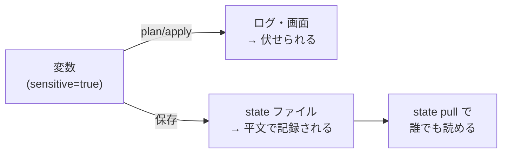

## このセクションで学ぶこと

- パスワードや API キーなどの秘匿情報を Terraform でどう渡すか
- sensitive 属性で plan / apply のログ出力から値を隠す方法
- 秘匿情報が state ファイルに平文で記録されるという前提と対策

## 秘匿情報を「コードに直接書かない」

データベースのパスワードや API キー、TLS の秘密鍵などは、インフラ構成のあちこちで必要になります。しかしこれらを `.tf` ファイルに直接書き込むのは禁物です。Terraform のコードは Git で管理するのが普通なので、いちどコミットしてしまえばリポジトリの履歴に半永久的に残り、削除しても過去のコミットから復元できてしまいます。

基本方針は「秘匿情報はコードの外から注入する」ことです。よく使うのは変数(variables)経由で外部から渡す方法です。

```hcl
variable "db_password" {
  type      = string
  sensitive = true
}

resource "aws_db_instance" "main" {
  username = "admin"
  password = var.db_password
  # ... 他の設定 ...
}
```

値の渡し方には次のような選択肢があります。`terraform.tfvars` に書く方法は手軽ですが、このファイル自体を `.gitignore` に必ず追加します。CI/CD など自動実行の環境では、`TF_VAR_db_password` という環境変数を使うのが定番です。

```bash
export TF_VAR_db_password='S3cr3t!'
terraform apply
```

## sensitive で画面・ログから隠す

上の例で変数に `sensitive = true` を付けました。これを指定すると、Terraform は plan / apply の出力でその値を `(sensitive value)` と伏せて表示します。

```hcl
output "db_endpoint" {
  value     = aws_db_instance.main.endpoint
  sensitive = true
}
```

これにより、ターミナルに表示されたり CI のログに残ったりして第三者の目に触れる事故を防げます。注意点として、sensitive を付けた値を文字列連結などで別の値に組み込むと、その派生した値も sensitive として扱われます。意図せず広い範囲が伏せられて plan が読みにくくなることがあるので、必要な箇所にだけ付けるのがコツです。

## state には平文で残る、という前提を持つ

ここが最も誤解されやすい点です。**sensitive を付けても、値は state ファイルには平文で記録されます。** sensitive はあくまで「画面・ログ表示を隠す」機能であり、保存される中身を暗号化するものではありません。`terraform state pull` や state ファイルを直接開けば、パスワードはそのまま読めてしまいます。



したがって対策は state ファイル側で行います。第 3 章で学んだ S3 バックエンドを使い、バケットの暗号化(SSE)を有効にし、アクセス権限を絞ります。ローカルの `terraform.tfstate` も Git にコミットしてはいけません。秘匿情報を扱うなら、state の保管場所そのものを「秘密と同等に守るべき対象」として扱う意識が欠かせません。

## まとめ

- 秘匿情報はコードに直接書かず、変数や `TF_VAR_` 環境変数で外から注入する。
- `sensitive = true` は plan / apply の画面・ログ表示を伏せるが、暗号化ではない。
- 値は state に平文で残るため、S3 バックエンドの暗号化とアクセス制限で state ごと守る。
