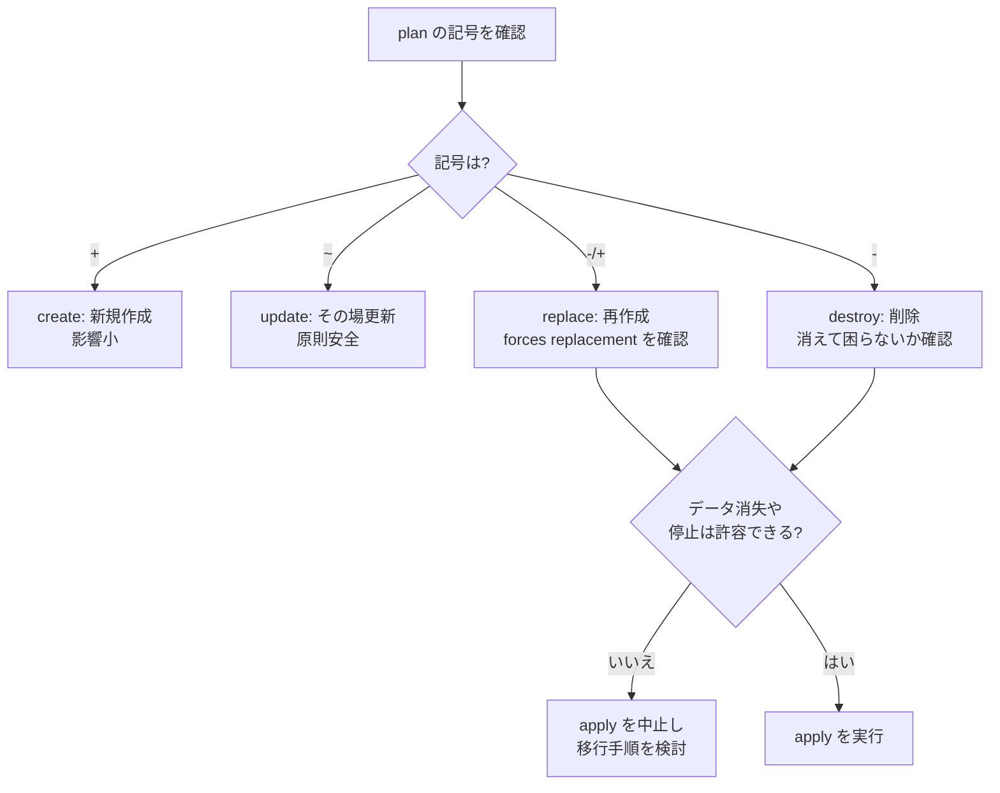

## このセクションで学ぶこと

- plan の出力に現れる create / update / replace / destroy の 4 つの記号の意味
- リソースが再作成(replace)される条件と、それがなぜ危険か
- apply 前に差分を読み、意図しない破壊を防ぐ確認手順

## plan の記号を読み分ける

`terraform plan` は、これから何が起きるかを記号付きで教えてくれます。apply の前にこの記号を正しく読むことが、安全な運用の第一歩です。記号は大きく 4 種類あります。

| 記号 | 種別 | 意味 |
| --- | --- | --- |
| `+` | create | 新規にリソースを作成する |
| `~` | update(in-place) | 既存リソースを残したまま属性を変更する |
| `-/+` | replace | 一度削除してから作り直す(再作成) |
| `-` | destroy | リソースを削除する |

plan の末尾には `Plan: 1 to add, 0 to change, 1 to destroy.` のようなサマリが出ます。この数字、特に「to destroy」が 0 でないときは必ず中身を確認します。

## 破壊的変更(replace)の見分け方

最も注意が必要なのが `-/+`(replace)です。これは「その属性は変更だけでは反映できないので、リソースを作り直す」という意味です。plan には理由も併記されます。

```text
  # aws_instance.web must be replaced
-/+ resource "aws_instance" "web" {
      ~ instance_type = "t3.micro" -> "t3.small" # forces replacement
```

`# forces replacement` というコメントが付いている属性が、再作成を引き起こした犯人です。これは属性が **ForceNew**(変更すると再作成が必要)としてプロバイダ側で定義されているために起こります。EC2 の AMI 変更や、RDS の一部設定変更などが典型例です。

replace が危険なのは、EC2 ならインスタンス上のデータが消える、RDS ならデータベースごと消えうる、IP アドレスが変わるなど、ダウンタイムやデータ消失に直結するためです。



## apply 前の確認を習慣にする

意図しない破壊を防ぐには、いくつかの定石があります。まず `terraform plan -out=tfplan` のように plan を保存し、その内容を確認してから `terraform apply tfplan` で「確認した plan そのもの」を適用します。これで plan と apply の間に状態がずれる心配がなくなります。

どうしても消えてほしくないリソースには `lifecycle { prevent_destroy = true }` を付けておくと、destroy や replace を伴う apply がエラーで止まり、事故を防げます。逆に replace は避けられないがダウンタイムを抑えたい場合は `create_before_destroy = true` で「先に新しい方を作る」順序に変えられます。いずれにせよ、サマリの「to destroy」と `# forces replacement` を必ず目視で確認する習慣が、最大の防御策です。

## まとめ

- plan の `+ / ~ / -/+ / -` は create / update / replace / destroy を表す。
- `# forces replacement` が付く属性は ForceNew で、リソース再作成(データ消失リスク)を引き起こす。
- plan を保存して apply し、prevent_destroy や create_before_destroy で破壊を制御する。
