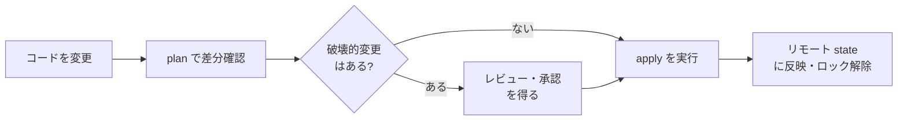

## このセクションで学ぶこと

- terraform destroy が何を削除するのか、その影響範囲を理解する
- 特定リソースだけを対象にする -target や保護設定の使いどころ
- チームで Terraform を安全に運用するための基本的な心得

## destroy は「state 全体」を消しにいく

`terraform destroy` は、その構成(state)で管理しているリソースを**まとめて削除する**コマンドです。ここで重要なのは、対象が「いま開いている `.tf` ファイル」ではなく「state に記録されている全リソース」だという点です。VPC・サブネット・EC2・RDS をひとつの構成で管理していれば、destroy 一発でそのすべてが消えます。

destroy も実行前に plan と同じ差分プレビューを表示し、`Do you really want to destroy all resources?` と確認を求めます。ここで `yes` と打つ前に、サマリの削除数と一覧を必ず読みます。とくに本番環境では、「テスト環境のつもりが本番の state を指していた」という取り違えが致命傷になります。実行前に `terraform workspace show` やバックエンド設定で、自分がどの環境を操作しているかを確認する癖をつけてください。

## 影響範囲を絞る・守る

全部消すのではなく一部だけ消したい、あるいは絶対に消したくないリソースがある場合の手段を押さえておきましょう。

一時的に特定リソースだけ操作したいときは `-target` を使います。

```bash
terraform destroy -target=aws_instance.web
```

ただし `-target` は依存関係を無視して部分操作するため、state と実体がずれる原因になりがちです。あくまで応急処置と考え、常用は避けます。

恒久的に守りたいリソースには、前のセクションでも触れた `prevent_destroy` を付けます。

```hcl
resource "aws_db_instance" "main" {
  # ...
  lifecycle {
    prevent_destroy = true
  }
}
```

これを付けておくと、destroy や replace を伴う操作がエラーで止まり、データベースのような「消えたら戻せない」リソースを守れます。

## チーム運用の心得

最後に、複数人で運用するときの基本姿勢を整理します。下図は、変更を適用するまでの安全な流れです。



要点は次の通りです。まず、変更は必ず plan を経由し、破壊的変更があるならレビューを通す。次に、state はリモート(S3 など)で共有しロックを使い、各自のローカル state で勝手に apply しない。そして、本番に近い環境ほど `prevent_destroy` や手動承認のステップを厚くする。Terraform は強力なぶん、確認を省くと一瞬で大量のリソースを消せます。「plan を読む」「環境を確かめる」「壊せないものは保護する」——この 3 つを徹底することが、安全運用の核心です。

## まとめ

- destroy は `.tf` ではなく state 全体を対象に削除する。実行環境とサマリを必ず確認する。
- `-target` は応急処置、`prevent_destroy` は消したくないリソースの恒久的な保護に使う。
- plan 経由・レビュー・リモート state とロックで、チームでの破壊事故を防ぐ。
