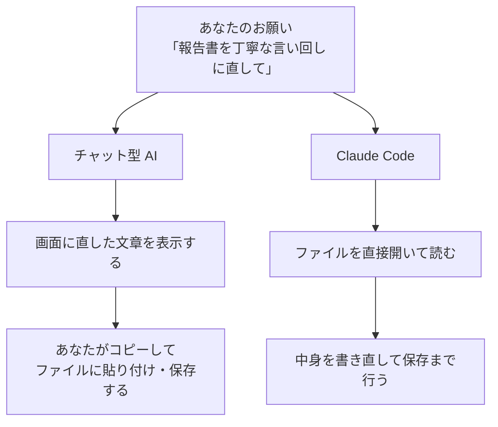

## このセクションで学ぶこと

- チャット型 AI は「言葉で答えを返す」までが仕事だということ
- Claude Code は手元のファイルに直接、作業まで行えること
- 「答えをもらう」と「作業をやってもらう」の違いを区別できること

## チャット型 AI は「答えを返す」までが仕事

最近では、質問を打ち込むと文章で答えてくれる AI を使ったことがある方も多いでしょう。こうした AI を、ここでは**チャット型 AI** と呼びます。とても便利ですが、その仕事には一つの区切りがあります。**答えを文章で返すところまで**、ということです。

たとえばチャット型 AI に「報告書の文章を丁寧な言い回しに直して」とお願いすると、直した文章が画面に表示されます。けれども、その文章を実際の報告書ファイルに反映させるのは、あなた自身の役目です。表示された文章をコピーして、自分でファイルを開いて、貼り付けて、保存する。この最後の作業は、人がやらなければなりません。

チャット型 AI は、いわば「アドバイスをくれる相談相手」です。良い答えはくれますが、机の上の書類に手を出すことはありません。

## Claude Code は「作業まで」やってくれる

一方の Claude Code は、もう一歩ふみこみます。答えを返すだけでなく、**あなたのパソコンにある実際のファイルを、直接読んだり書き直したりできる**のです。

先ほどの例で言えば、Claude Code には「報告書ファイルの文章を丁寧な言い回しに直して保存して」と頼めます。すると、相棒がそのファイルを開いて中身を読み、書き直して、保存するところまで一気にやってくれます。あなたがコピーや貼り付けをする必要はありません。

この違いを図で整理してみましょう。

図の左側がチャット型 AI、右側が Claude Code です。チャット型 AI では最後の「ファイルに反映する」作業が人に残りますが、Claude Code はそこまで引き受けてくれる、という違いがひと目で分かります。

## 「答えをもらう」のか「作業をやってもらう」のか

ここで大切な見分け方をお伝えします。**「答えがほしい」のか、「作業そのものをやってほしい」のか**で、向いている道具が変わります。

「この言葉の意味を教えて」「アイデアを 5 つ出して」のように、頭の中で受け取って終わる相談ごとは、チャット型 AI でも十分です。一方で、「このフォルダの 10 個のファイルの名前を整えて」「資料を読んで一覧表に作り直して」のように、**実際のファイルに手を加える作業**は、Claude Code の出番です。

もちろん Claude Code でも、ただ質問して答えをもらうこともできます。つまり Claude Code は、チャット型 AI の相談相手としての役割に、「実際の作業まで手を出せる」という力を足したもの、とイメージすると分かりやすいでしょう。

## まとめ

- チャット型 AI は文章で答えを返すまでが仕事で、ファイルへの反映は人が行います。
- Claude Code は手元のファイルを直接読み書きし、作業まで仕上げてくれます。
- 「答えがほしい」のか「作業をやってほしい」のかで、向いた道具が変わります。
