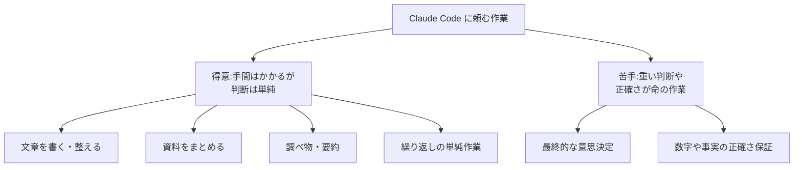

## このセクションで学ぶこと

- Claude Code が得意な作業を 4 つの分野(文章・資料・調べ物・繰り返し)で整理します
- それぞれの分野で「実際にどんなお願いができるか」を具体例で知ります
- 「手間はかかるが頭はそれほど使わない作業」が得意分野だと理解します

## Claude Code が得意な4つの分野

Claude Code は、なんでも完璧にこなす魔法の道具ではありません。けれども「得意な分野」をつかんでおくと、ぐっと頼みやすくなります。大きく分けると、得意なのは次の 4 つの分野です。**文章を書く・整える**、**資料をまとめる**、**調べ物をする**、**繰り返しの単純作業をこなす**。

これらに共通するのは、「手間はかかるけれど、それほど高度な判断はいらない作業」だという点です。人間がやると時間がかかって面倒に感じる作業ほど、Claude Code の助けが効いてきます。下の図で、得意なことと(次のセクションで扱う)苦手なことを早見表として整理してみましょう。

## それぞれの分野での具体例

**文章を書く・整える**では、メールの下書き、お知らせ文の作成、長い文章の言い回しをやわらかくする、誤字脱字のチェックといったお願いができます。ゼロから書くのが苦手な人ほど、最初の「たたき台」を作ってもらうと楽になります。白紙から書き始めるよりも、たたき台に手を入れるほうが、ずっと気持ちが軽くなるものです。たとえば「取引先へのお詫びメールの下書きを、丁寧な言葉づかいで作って」とお願いすれば、骨組みのある文章がすぐに返ってきます。

**資料をまとめる**では、長い議事録を要点だけに短くしたり、箇条書きのメモを読みやすい文章に整えたりできます。「この内容を 3 行でまとめて」「小学生にも分かる言葉に直して」といった頼み方も得意です。会議のあとに残った長いメモを、上司に共有できる形に整えてもらう、といった使い方がイメージしやすいでしょう。

**調べ物をする**では、手元の文書の中から必要な情報を探したり、内容を要約したりできます。たくさんのファイルに目を通すのは人間には骨が折れますが、Claude Code は素早く拾い読みしてくれます。「このフォルダの中から、締め切りに触れている箇所を探して」といったお願いで、探し物の時間を大きく減らせます。

**繰り返しの単純作業**では、たくさんのファイルの名前をそろえて付け替える、決まった形式に整える、といった地味で時間のかかる作業を任せられます。人間がやると単調で集中力が続きにくい作業ほど、AI に任せる価値があります。手作業だと数十分かかる整理が、頼むだけで一気に片づくことも珍しくありません。

## 注意点

得意分野であっても、出てきた結果をそのまま使わず、必ず人が目を通すことが前提です。特に文章や資料は「たたき台」として受け取り、自分の言葉で仕上げる意識を持つと安心です。得意なことを知るのと同じくらい、次のセクションで扱う「苦手なこと」を知っておくことが、上手な付き合い方の第一歩になります。

## まとめ

- 得意なのは「文章・資料・調べ物・繰り返し作業」の 4 分野です
- 共通点は「手間はかかるが判断は単純な作業」であることです
- 得意分野でも結果は人が確認し、たたき台として使うのが基本です
