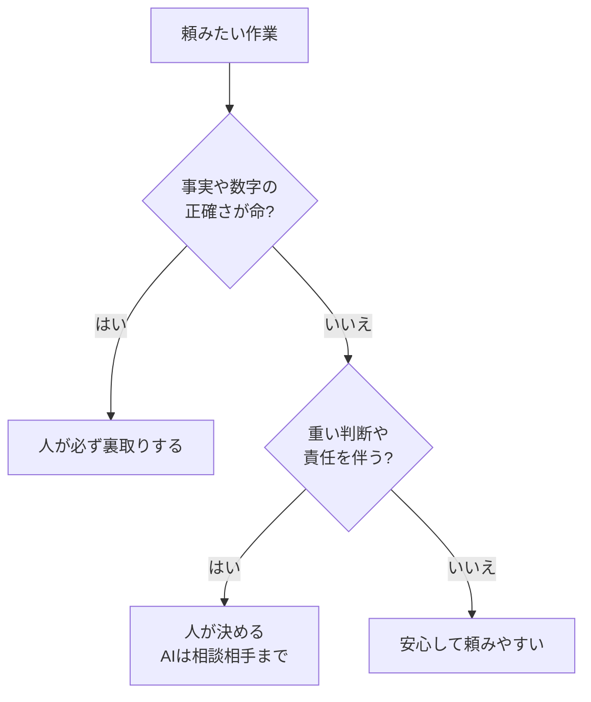

## このセクションで学ぶこと

- Claude Code が苦手とする作業や間違えやすい場面を具体的に知ります
- 「それらしく書くが事実とは限らない」という性質を理解します
- 任せきりにすると危ういのはどんなときかを見分けられるようになります

## なぜ間違えることがあるのか

Claude Code はとても流暢に文章を書きますが、その流暢さこそが落とし穴になることがあります。AI は「もっともらしい続きの言葉」を組み立てるのが得意で、内容が本当に正しいかどうかを保証しているわけではありません。そのため、事実でないことを、いかにも正しそうな文章で書いてしまうことがあります。これは**思い込みの作り話**と呼ばれ、AI に共通する弱点です。

ここがチャット型 AI と Claude Code に共通する大事な性質です。流暢さと正確さは別物だと、いつも頭の片隅に置いておきましょう。文章がきれいに整っているほど「正しそう」に見えてしまうため、かえって間違いに気づきにくくなる、という難しさもあります。読みやすさと正しさは、まったく別の尺度なのです。

## 苦手なこと・間違えやすい場面

具体的に苦手なのは、次のような場面です。

**事実や数字の正確さが命の作業**では注意が必要です。日付・金額・人名・統計などは、間違っていても堂々と書いてしまうことがあります。「○○という法律では…」と書かれていても、その条文が実在するとは限りません。

**ごく最近の最新情報**も苦手です。AI は学習した時点までの知識をもとに答えるため、昨日のニュースや今この瞬間の数値は知らないことがあります。

**重い意思決定や責任を伴う判断**も任せるべきではありません。「この契約を結ぶべきか」「この人を採用すべきか」といった判断は、人が責任を持って行うものです。AI は判断の材料を整理する手伝いはできますが、最後に決めて責任を負うことはできません。

**その場の状況や、言葉にしていない事情をくむこと**も苦手です。社内の人間関係や、相手の機嫌、これまでの経緯といった「空気」は、お願いの文章に書かれていなければ AI には分かりません。人どうしなら自然にくみ取れる前提も、AI には一から伝える必要があります。逆に言えば、背景をていねいに伝えるほど、ずれの少ない結果が返ってきます。

## 注意点

苦手だからといって「使ってはいけない」わけではありません。たとえば調べ物のきっかけ作りや、考えを整理するたたき台としては十分に役立ちます。大切なのは、出てきた事実や数字を**そのまま信じず、必ず元の資料で確かめる**ことです。特に外部に出す文書や、お金・契約・健康に関わる内容は、人の目による裏取りを省略しないでください。

見分け方の目安はかんたんです。「これが間違っていたら困るか?」と自分に問いかけてみてください。困る作業ほど、人の確認を厚くする。困らない作業なら、気軽に任せてよい。この一線を意識するだけで、危ない任せ方をぐっと減らせます。

## まとめ

- AI は流暢でも、事実でない作り話を書いてしまうことがあります
- 数字・最新情報・重い判断は特に苦手で、任せきりは危険です
- 出てきた内容は元の資料で裏取りする習慣が欠かせません
