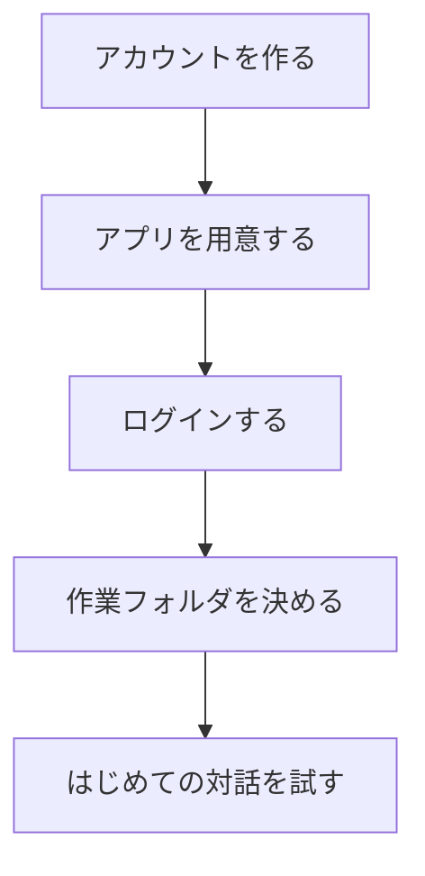

## このセクションで学ぶこと

- 準備からはじめての対話までの大まかな流れを順番でつかむ
- 各ステップが「何のための一歩なのか」を理解する
- つまずいたときにどこを見直せばよいかを知る

## セットアップは「流れ」でつかむと迷わない

前のセクションで、用意するものが「アカウント」「アプリ」「作業フォルダ」の 3 つだと分かりました。このセクションでは、それらをどんな順番でそろえ、どうやってはじめての対話までたどり着くのか、全体の流れを見ていきます。

セットアップと聞くと身構えてしまうかもしれませんが、やることを一本道の流れとして並べると、実はとてもシンプルです。料理でいえば「材料をそろえる → 道具を準備する → 作業台を決める → 作り始める」という順番に似ています。一つずつ片づけていけば、必ずゴールにたどり着けます。

下の図は、準備からはじめての対話までの流れを表したものです。

## 各ステップが何のための一歩なのか

それぞれのステップには、ちゃんと役割があります。

まず **アカウントを作る** のは、Claude Code に「私はこの人です」と伝えるためでした。次に **アプリを用意する** のは、相棒に話しかける窓口を手元に置くためです。続いて **ログインする** ことで、作ったアカウントとアプリが結びつき、「あなた専用の状態」で使えるようになります。

その次の **作業フォルダを決める** は、手伝ってほしいファイルがある場所を指定する一歩です。ここまで来たら、いよいよ **はじめての対話を試す** 段階です。「こんにちは」と話しかけてみたり、「このフォルダにどんなファイルがあるか教えて」とお願いしてみたりして、ちゃんと反応が返ってくるかを確かめます。ここまでたどり着けば、セットアップは完了です。

## 注意点 — つまずいたらどこを見るか

もし途中でうまくいかないときは、「今どのステップにいるか」を思い出すと原因を見つけやすくなります。たとえば、話しかけても反応がない場合は、その前の「ログイン」がきちんとできているかを見直します。フォルダの中身が見えない場合は、「作業フォルダを正しく選べているか」を確認します。

このように、流れのどこで止まったかが分かれば、見直す場所はぐっと絞れます。エラーらしき文字が出ても慌てず、一つ前のステップに戻って確かめてみてください。それでも解決しないときの心構えは、後の章でも触れていきます。

もう一つ覚えておくと安心なのは、これらのステップのうち、最初の数ステップは「一度きり」だということです。アカウントを作る・アプリを用意する・ログインする、という前半の準備は、最初に一度すませてしまえば、次からは省略できます。二回目以降は「作業フォルダを決める → 対話する」の二歩だけで使い始められるので、回を重ねるほど準備はどんどん軽くなっていきます。最初の一回だけ少し丁寧に進めれば、あとはぐっと楽になる、と考えてください。

## まとめ

- セットアップは「アカウント → アプリ → ログイン → 作業フォルダ → 対話」の一本道
- 各ステップには「私を伝える」「窓口を置く」など、それぞれの役割がある
- つまずいたら「今どのステップか」を思い出し、一つ前に戻って確認する
