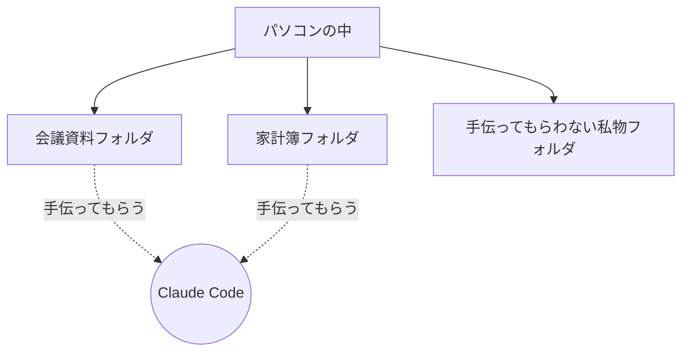

## このセクションで学ぶこと

- 作業フォルダが「Claude Code が手を出してよい範囲」を決めるものだと理解する
- フォルダを分けておくことの安心感とメリットを知る
- はじめのうちに気をつけたいフォルダの選び方を押さえる

## 作業フォルダは「お願いする範囲」を区切る仕切り

セットアップの流れの中で出てきた「作業フォルダ」は、Claude Code を安心して使ううえでとても大切な考え方です。ひとことで言うと、作業フォルダは **Claude Code が読み書きしてよいファイルの範囲を区切る仕切り** です。

第 1 章で見たように、Claude Code はチャット型 AI と違い、手元のファイルに直接手を出せるのが特徴でした。とても便利な反面、「どのファイルまで触ってよいのか」をはっきりさせておかないと、思わぬファイルまで変えられてしまわないか不安になります。そこで、「この部屋の中のものなら手伝ってもらってよい」とあらかじめ範囲を決めておくのが、作業フォルダの役割です。

たとえるなら、職人さんに作業をお願いするとき、家じゅう自由に出入りしてもらうのではなく、「作業部屋はここです」と一室を割り当てるようなものです。相棒はその部屋の中のファイルを見たり、整えたり、新しく作ったりしますが、部屋の外には手を出しません。

## 具体例 — 内容ごとにフォルダを分ける

たとえば、会議資料づくりと、家計簿の整理を Claude Code に手伝ってもらうとします。このとき、それぞれ別のフォルダを用意しておくと安心です。

会議資料を頼むときは会議資料フォルダを、家計簿を頼むときは家計簿フォルダを作業フォルダにします。私物のフォルダは作業フォルダにしなければ、相棒がそこに勝手に手を出すことはありません。こうして内容ごとに部屋を分けておくと、「今は何を手伝ってもらっているのか」が自分でも分かりやすくなります。

フォルダを分けておくと、もう一つうれしいことがあります。それは、頼みごとがすっきり伝わるようになることです。たとえば会議資料フォルダだけを作業フォルダにしておけば、「このフォルダの資料を読みやすく整えて」とお願いしたとき、相棒は迷わず会議資料だけに目を向けてくれます。もし家じゅうのファイルが一緒くたに入っていたら、「どの資料のこと?」と話がかみ合わなくなってしまいます。範囲が絞られているほど、こちらの意図も正しく伝わりやすいのです。

また、フォルダを分けておくと、後から「あのとき何を手伝ってもらったか」を振り返るのも簡単です。会議資料フォルダを開けば、整えてもらった資料がそこにまとまっています。仕事の内容ごとに引き出しが分かれているようなもので、探しものが減り、気持ちにも余裕が生まれます。

## 注意点 — 最初は小さなフォルダから

はじめのうちは、いきなりパソコン全体や、たくさんのファイルが入った大きなフォルダを作業フォルダにするのは避けましょう。範囲が広すぎると、何が起きているか把握しづらくなります。まずは練習用の小さなフォルダを一つ作り、その中で試すのがおすすめです。慣れてきたら、扱う範囲を少しずつ広げていけば十分です。

## まとめ

- 作業フォルダは「Claude Code が手を出してよいファイルの範囲」を区切る仕切り
- 内容ごとにフォルダを分けると、何を手伝ってもらっているか分かりやすい
- 最初は小さな練習用フォルダから始め、慣れたら範囲を広げる
