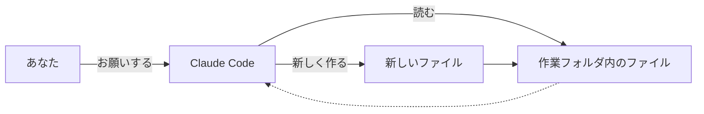

## このセクションで学ぶこと

- Claude Code は作業フォルダの中のファイルを読んだり新しく作ったりできること
- ファイルを読ませるときは「ファイル名」を伝えればよいこと
- 作ってもらったファイルがどこに置かれるかを意識すること

## ファイルを「読む・作る」のが Claude Code の持ち味

前の章で見たように、Claude Code がチャット型 AI と違うのは、手元のファイルに直接手を出せるところでした。つまり、こちらが内容を貼り付けて渡さなくても、フォルダの中にあるファイルをそのまま読んでくれますし、新しいファイルを作って保存することもできます。これが、ただ言葉を返すだけの AI との大きな違いです。

ただし、Claude Code が扱えるのは「作業フォルダ」と決めた一つのフォルダの中身だけです(作業フォルダの考え方は第 3 章で扱いました)。パソコン全体のどこでも自由に触れるわけではなく、その決められた範囲の中で読み書きをします。これは安全のための仕組みでもあり、うっかり関係のないファイルをいじられる心配を減らしてくれます。

## ファイル名を伝えて読ませる

ファイルを読ませるのはとても簡単で、ファイル名を文章の中に書くだけです。たとえば作業フォルダに「議事録.txt」が入っているなら、こう頼みます。

「議事録.txt を読んで、決まったことだけを箇条書きにして。」

すると Claude Code は、そのファイルを開いて中身を確認し、お願いどおりに箇条書きを返してくれます。複数のファイルをまとめて扱うこともできます。「フォルダの中の議事録を全部読んで、今月の決定事項を一覧にして」のように、ざっくりした指定でも対応してくれることが多いです。

作ってもらうときも同じ要領です。「いまの箇条書きを『決定事項.txt』という名前でフォルダに保存して」と頼めば、新しいファイルが作業フォルダの中に作られます。下の図は、こうした読み書きの関係を表したものです。

## 「どこに置かれたか」を確かめる習慣を

ここで注意したいのは、作ってもらったファイルがどこに置かれたかを、自分でも確かめる習慣をつけることです。Claude Code は基本的に作業フォルダの中にファイルを作りますが、思っていた場所と違ったり、似た名前のファイルを上書きしてしまったりする可能性もゼロではありません。

ですから、作業が終わったら実際にフォルダを開いて、狙ったファイルがそこにあるか、中身が想定どおりかを目で見て確認しましょう。とくに大事なファイルを扱うときは、あらかじめコピーをとっておくと安心です。「読む・作る」が手軽だからこそ、最後は自分の目で確かめる——この一手間が、安心して使い続けるコツになります。

## まとめ

- Claude Code は作業フォルダの中のファイルを読んだり、新しく作ったりできる。
- ファイルを読ませるには、お願いの文章にファイル名を書くだけでよい。
- 作ってもらったファイルは、どこに置かれたか・中身が正しいかを自分の目で確かめる。
