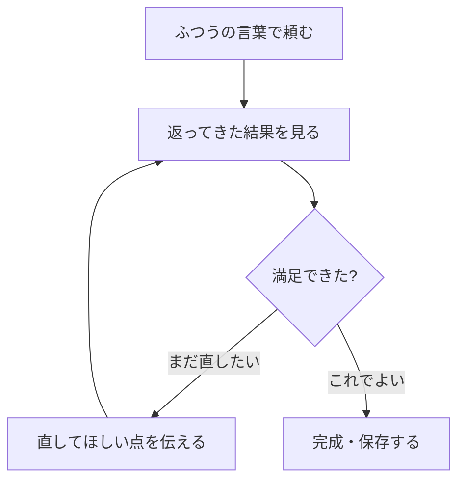

## このセクションで学ぶこと

- 望む結果は一度では出ず、対話を往復しながら近づけていくのがふつうであること
- 「頼む→結果を見る→直してもらう」のループの進め方
- 直してほしいところは具体的に伝えると早く仕上がること

## 一発で完成しなくてあたりまえ

Claude Code を使っていると、最初のお願いだけでぴったり望みどおりの結果が返ってくることは、むしろ少ないかもしれません。「思っていたより長い」「言葉づかいが固い」「大事な点が抜けている」——そんなふうに感じることはよくあります。けれども、それは失敗ではありません。Claude Code との作業は、一回の命令で完結させるものではなく、何度かやりとりを重ねて仕上げていくのが本来の使い方だからです。

これは、人に下書きをお願いするときと似ています。最初に出てきたたたき台を見て「ここはこうしてほしい」と注文を伝え、何度か直してもらううちに、ちょうどよい形になっていきます。Claude Code 相手でも、まったく同じ感覚で進められます。むしろ、相手が人ではないぶん、何度頼み直しても気をつかわずにすみますし、待たされることもほとんどありません。「一回で決めなければ」という気負いを手放すことが、かえって早くよい結果にたどり着く近道になります。

## 「頼む→見る→直す」のループ

この進め方を図にすると、次のような往復のループになります。

ポイントは、結果を見たあとに「ここを直して」とそのまま続けて頼める点です。最初からやり直す必要はありません。たとえば資料のたたき台を作ってもらったあとなら、こんなふうに少しずつ注文を重ねていきます。

「もう少し短くして、3 つの段落にまとめて。」
「2 つめの段落に、コスト面の話を一文足して。」
「全体をもう少しやわらかい言葉づかいにして。」

このように、前の結果を踏まえたまま小さな修正を重ねられるので、毎回ゼロから説明し直す手間がありません。

## 直してほしいところは具体的に

往復をスムーズに進めるコツは、直してほしいところをできるだけ具体的に伝えることです。「なんか違う」「いまいち」だけでは、どこをどう変えればよいか伝わりません。「結論を最初に持ってきて」「専門用語を減らして」「箇条書きを表に変えて」のように、変えてほしい場所とその方向をセットで示すと、一度で狙いどおりに近づきます。

また、何度か往復しても思った方向に進まないときは、いったん区切って最初の頼み方を見直すのも手です。同じ言い方で直しを重ねても堂々巡りになることがあるので、そんなときは「いったん白紙に戻して、こういう方針で作り直して」と仕切り直すと、すっきりと前に進めます。次のセクションでは、そもそも最初から伝わりやすくするための頼み方のコツを紹介します。

## まとめ

- Claude Code との作業は、一度で完成させず往復しながら仕上げるのがふつう。
- 「頼む→結果を見る→直してもらう」を繰り返し、前の結果に注文を重ねていく。
- 直してほしい場所と方向を具体的に伝えると、早く望む形に近づく。
