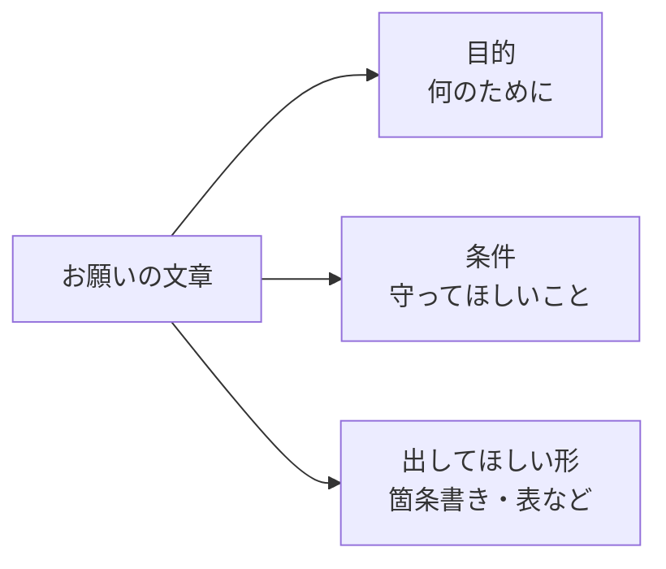

## このセクションで学ぶこと

- 望む結果に近づけるための「伝え方の型」を知っておくこと
- 目的・条件・出してほしい形を具体的に添えると伝わりやすいこと
- 長く複雑なお願いは小さく分けて頼むとうまくいくこと

## 「伝え方の型」を覚えておくと安心

ここまでで、ふだんの言葉で頼んでよいこと、対話を往復しながら仕上げていくことを見てきました。最後に、最初のお願いの段階で伝わりやすくするための、ちょっとしたコツを紹介します。難しいテクニックではなく、人に仕事を頼むときにも使っている「伝え方の型」を意識するだけです。

その型とは、**目的・条件・出してほしい形**の 3 つをそろえて伝える、というものです。「目的」は何のためにやるか、「条件」は守ってほしい決まりごと、「出してほしい形」は結果をどんな見た目で受け取りたいか、です。この 3 つがそろっていると、Claude Code はこちらの意図をくみ取りやすくなり、最初の一回でぐっと望みに近い結果が返ってきます。

## 3 つをそろえて頼んでみる

具体例で見てみましょう。たとえば「会議の案内メールを作って」とだけ頼むより、次のように添えるほうが、ねらいどおりの文章が返ってきます。

「来週の部内会議の案内メールを作って(目的)。社外の人は宛先に含めないで、日時と場所だけは必ず入れて(条件)。本文は 5 行くらいの短い文章で(出してほしい形)。」

このように、何のための文章で、何を守ってほしくて、どんな長さや形にしたいかを添えるだけで、伝わり方が大きく変わります。とくに「箇条書きにして」「表にまとめて」「3 つの段落で」といった、出してほしい形の指定は効果が大きく、結果の見やすさが一段と整います。

もうひとつのコツは、**長くて複雑なお願いは小さく分ける**ことです。「資料を作って、要約も付けて、さらに英語にも訳して」と一度に頼むより、一つずつ順番にお願いするほうが、それぞれの結果を確かめながら進められて確実です。

## 細かく指定しすぎなくてもよい

一方で、注意したい点もあります。それは、最初から完璧に細かく指定しようと気負いすぎなくてよい、ということです。3 つの型はあくまで「伝わりやすくするための目安」であって、すべてをきっちり埋めなければいけない決まりではありません。

実際には、まず思いついたままに頼んでみて、返ってきた結果を見てから「条件を足す」「形を変える」と注文を重ねていくほうが、かえって早く仕上がることもよくあります。前のセクションで見た「往復」と、この「伝え方の型」は組み合わせて使うものです。型を頭の片隅に置きつつ、気軽に話しかけて反応を見る——この二つのバランスが、Claude Code とうまく付き合うコツです。

## まとめ

- 「目的・条件・出してほしい形」の 3 つをそろえると、ねらいどおりの結果に近づく。
- とくに「箇条書き・表・段落数」など出してほしい形の指定は効果が大きい。
- 長く複雑なお願いは小さく分け、足りなければ往復で注文を重ねればよい。
