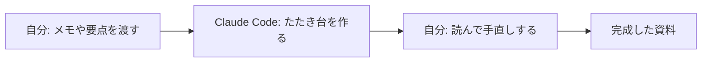

## このセクションで学ぶこと

- 資料作成で Claude Code に手伝ってもらえる具体的な場面を知る
- 調べ物や下書きを頼むときの上手な使い方をイメージする
- 「たたき台を作ってもらい、自分が仕上げる」という役割分担を理解する

## 資料作成は「たたき台づくり」がいちばん得意

Claude Code がもっとも力を発揮するのは、ゼロから何かを書き起こす場面です。たとえば「来月の勉強会の案内文を作ってほしい」「お客様へのお礼メールの文面を考えてほしい」とふつうの言葉でお願いするだけで、すぐに文章の下書きを用意してくれます。

ここで大切なのは、出てきたものを完成品ではなく**たたき台**として受け取る、という考え方です。最初から 100 点の文章が出てくることはまれですが、80 点くらいの下書きが数秒で手元に届くと考えれば、白紙から書き始めるよりずっと楽になります。文章を一から考えるときに、いちばん時間と気力を使うのは「最初の一行をどう書き出すか」です。その重い最初の一歩を肩代わりしてもらえると考えると、価値が分かりやすいかもしれません。あとは自分の言葉で手直しし、足りない情報を加えれば完成です。

調べ物も同じです。「この資料の内容を 5 行で**要約**して」「専門用語を、知らない人にも分かるように言い換えて」とお願いすれば、長い文章の要点を素早く整理してくれます。とくに、読むのに時間のかかる長い報告書やマニュアルを前にしたとき、まず全体像をつかむための要約を作ってもらうと、どこを重点的に読むべきかの見当がつきます。

## 具体例 — こんな場面で役立つ

非エンジニアの仕事のなかで、次のような場面がよくあります。

- 会議の議事メモを渡して、清書した議事録にまとめてもらう
- 箇条書きのメモから、案内文やお知らせの文章を組み立ててもらう
- 長い報告書を読ませて、上司に共有する用の短い要約を作ってもらう
- 同じ内容を、社外向け・社内向けの 2 つのトーンで書き分けてもらう

このように、ネタ出しや下書きという「いちばん腰が重い部分」を肩代わりしてもらい、最終的な判断と仕上げは自分が握る、という分担がうまくいくコツです。

## 注意点 — 中身は必ず自分で確かめる

便利な一方で、出てきた文章をそのまま使うのは禁物です。Claude Code は事実を取り違えたり、もっともらしい嘘を書いたりすることがあります(これは第 2 章で学んだ「苦手なこと」のひとつです)。

特に、日付・金額・固有名詞・数字といった、間違うと困る情報は、必ず自分の目で元の資料と照らし合わせてください。たとえば案内文に書かれた開催日や、お礼メールに記した先方の役職名などは、たとえ自然な文章に見えても鵜呑みにせず確かめる必要があります。要約も同じで、短くまとめる過程で大事な一文が抜け落ちていないかを確認する習慣が大切です。あくまで「下書きを作る助手」であって、「内容を保証してくれる人」ではない、と覚えておきましょう。最後に責任を持って世に出すのは、いつでも自分自身です。

## まとめ

- 資料作成では、完成品ではなく「たたき台」を素早く作ってもらうのが得意。
- 調べ物・要約・言い換えも頼めるが、要点の抜けに注意する。
- 日付や金額などの大事な情報は、必ず自分で元資料と確かめる。
