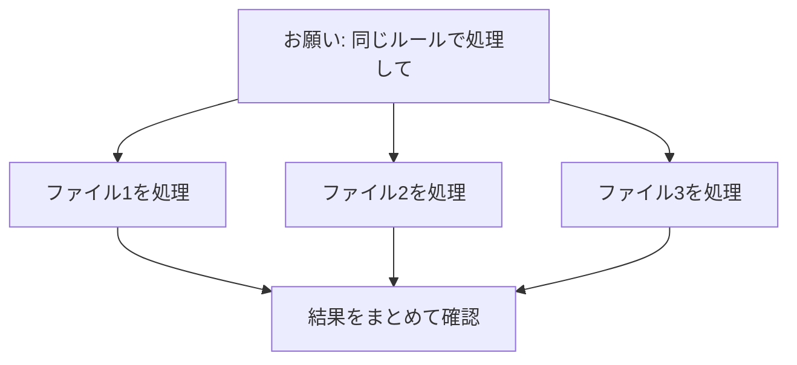

## このセクションで学ぶこと

- 何度も同じ手順を繰り返す作業こそ Claude Code に向いていることを知る
- 複数のファイルをまとめて処理してもらう活用例をイメージする
- 任せるときも「お手本を見せて確認する」進め方を理解する

## 「めんどうな繰り返し」は得意分野

人間がやると時間がかかって飽きてしまう、単調な繰り返し作業。実はこれこそ Claude Code が得意とする場面です。人は同じ作業を 100 回繰り返すと集中力が切れてミスをしますが、Claude Code は最後まで同じ調子で淡々と進めてくれます。気が散ったり面倒に感じたりすることがないので、件数が多くなるほど人手でやるより頼りになります。

こうした作業は、一つひとつは難しくないのに数が多いせいで時間を奪われる、という性質を持っています。たとえば「ファイルを開いて、決まった場所を直して、保存して、閉じる」を何十回も繰り返すような仕事です。手順そのものは単純でも、件数が増えれば半日仕事になってしまうことも珍しくありません。こういう「単純だが量が多い」作業こそ、任せる価値が大きい場面です。

たとえば、フォルダの中にたくさんのファイルが入っていて、それぞれに同じ手を加えたいとき。「この作業フォルダにある資料を、全部おなじ書式に整えて」とお願いすれば、ファイルを一つひとつ開いて手で直す必要がなくなります。こうしたまとめての作業を**一括処理**と呼びます。作業フォルダの考え方は第 3 章で学んだとおりで、フォルダの中だけが Claude Code の作業範囲になります。

## 具体例 — こんな繰り返しを任せられる

- 数十個のファイルの**ファイル名の付け替え**を、決まったルールでそろえる
- 複数の文章ファイルから、特定の項目だけを抜き出して一覧表にまとめる
- 古い書き方の用語を、新しい言い方にすべて置き換える
- バラバラの形式の住所録を、一つの統一した形に整える

いちど頼み方が決まれば、似た作業が発生するたびに同じお願いを使い回せるのも便利な点です。

## 注意点 — まずは少数で「お手本」を確かめる

繰り返し作業を任せるときに気をつけたいのは、いきなり大量のファイルすべてを処理させないことです。一度に全部に手を加えてしまうと、もし頼み方の意図がうまく伝わっていなかった場合、すべてのファイルが思わぬ形に変わってしまいます。

そこでおすすめなのが、まず 2〜3 個だけ処理させて結果を確認し、思いどおりなら残りもお願いする、という進め方です。最初の数個が「お手本」の役割を果たします。お手本がきちんと自分の意図どおりに仕上がっていれば、同じ頼み方で残りを任せても安心できますし、もしずれていれば、被害が数個で済むうちに頼み方を直せます。

また、大事なファイルは作業前にコピーを取っておくと、万一おかしくなっても元に戻せて安心です。とくに置き換えや名前の付け替えのように、一度実行すると元の状態が分からなくなってしまう作業では、このひと手間が効いてきます。便利な自動化ほど、こうした「やり直せる準備」とセットで使うのが安全です。

## まとめ

- 単調な繰り返し作業や一括処理は、人より Claude Code が得意。
- ファイル名の付け替えや一覧化など、身近な事務作業に使える。
- いきなり全件ではなく、少数で結果を確かめてから本番に進める。
