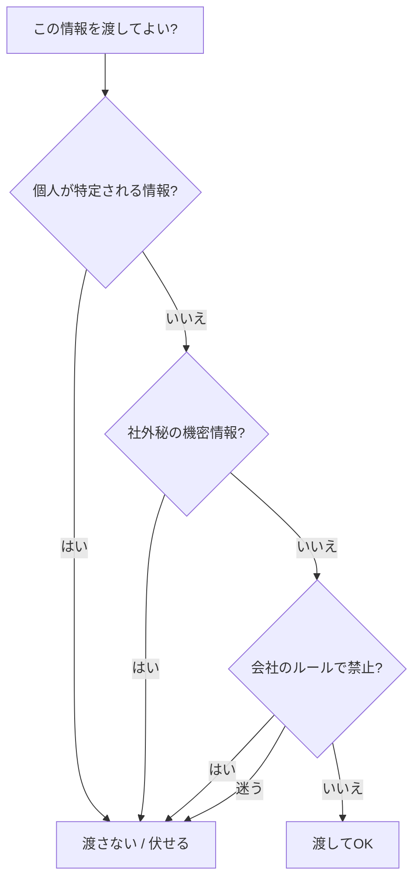

## このセクションで学ぶこと

- 機密情報・個人情報とは具体的に何を指すのかを理解する
- 渡してよい情報と渡してはいけない情報を切り分けられるようになる
- 困ったときは「会社のルールに従い、迷ったら渡さない」が原則だと知る

## なぜ情報の扱いに注意がいるのか

Claude Code に文章やファイルを渡すと、その内容は処理のために外部のサービスへ送られます。つまり、手元のパソコンの中だけで完結する作業ではない、ということです。だからこそ、何を渡してよいかを意識する必要があります。

ここで注意したいのが、**機密情報**と**個人情報**の 2 つです。機密情報とは、まだ公表していない売上や契約の中身、取引先との約束ごとなど、社外に出てはいけない会社の情報を指します。個人情報とは、氏名・住所・電話番号・マイナンバーなど、特定の誰かが分かってしまう情報のことです。これらをうっかり渡してしまうと、情報漏えいや会社のルール違反につながるおそれがあります。

ここで誤解しやすいのは、「便利だから何でも渡してよい」わけではない、という点です。Claude Code はあくまで仕事を効率化する道具であって、渡してよい情報かどうかを自分で判断してくれるわけではありません。判断するのはいつでも使う側の人間です。だからこそ、作業を頼む前に「この情報は外に出して大丈夫か」と一度立ち止まる習慣が欠かせません。

## 渡してよいか・いけないかを切り分ける

判断に迷ったら、次の流れで考えると整理しやすくなります。

ポイントは、ひとつでも引っかかったら「渡さない」を選ぶことです。安全側に倒すのが鉄則です。

## 具体例 — どうしても扱いたいときの工夫

たとえば顧客名簿の書式を整えてほしいけれど、名前そのものは見せたくない、という場面があります。こうしたときは、実際の氏名を「Aさん」「Bさん」や架空の名前に置き換えてから渡す方法があります。これを**マスキング**と呼びます。見せたくない部分を伏せ字や仮の値にしておけば、書式を整える作業はそのまま頼めます。

また、社内ルールで「外部サービスへの送信が許可されている範囲」が決まっている会社も多くあります。自分だけで判断せず、会社のガイドラインや情報システム部門の方針を必ず確認してください。

## 注意点 — 迷ったら渡さない

いちばん大切な原則は、**迷ったら渡さない**ことです。便利さよりも安全を優先しましょう。一度外に出てしまった情報は取り消せません。「これは渡してよいだろうか」と少しでも引っかかったら、その時点で渡すのをやめ、上司や担当部署に相談する。この一手間が、自分と会社を守ります。

## まとめ

- 渡した情報は外部に送られるため、機密情報・個人情報の扱いに注意する。
- 個人が特定される/社外秘/ルールで禁止のどれかに当たれば渡さない。
- どうしても扱うならマスキングし、迷ったら渡さず相談するのが原則。
