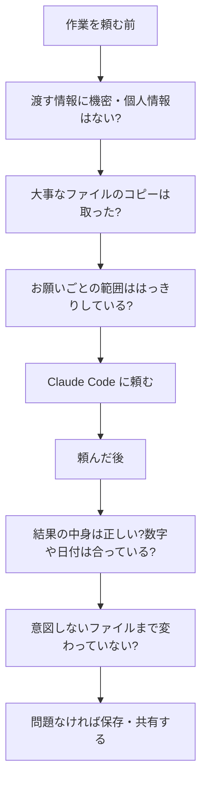

## このセクションで学ぶこと

- 作業を頼む前・頼んだ後に確認すべきことを、習慣として身につける
- 「結果をうのみにせず、最後は人が確かめる」というチェックの流れを理解する
- 困ったときやおかしいと感じたときの止め方・戻し方を知っておく

## 安全は「特別なこと」ではなく「習慣」

ここまでの章で、Claude Code は便利だけれど間違えることもある、機密情報の扱いには注意がいる、ということを学んできました。では、毎回どうすれば安全に使えるのでしょうか。答えは、難しい知識を身につけることではなく、ちょっとした確認をいつもの**チェック習慣**にしてしまうことです。

たとえば車を運転する前にミラーを合わせ、シートベルトを締めるように、決まった確認を体に染み込ませておけば、忙しいときでも事故を防げます。Claude Code でも同じで、「頼む前」と「頼んだ後」にそれぞれ短い確認を挟むだけで、ほとんどのトラブルは避けられます。

## 頼む前と頼んだ後のチェック

確認するタイミングは、大きく分けて作業の前と後の 2 つです。

頼む前には、渡してよい情報かを確かめ、大事なファイルは**バックアップ**を取り、お願いする範囲をはっきりさせます。頼んだ後には、結果の中身が正しいか、余計なところまで変わっていないかを自分の目で確かめます。この前後 2 回の確認が、安全に使い続けるための土台になります。

どれも特別に時間のかかることではありません。慣れてしまえば、それぞれ数秒から数十秒で済む確認です。大切なのは、忙しいときや急いでいるときほど、この確認を飛ばさないことです。事故は「いつもは確かめているのに、今日だけ省いた」というときに起きやすいからです。前後の確認をセットで習慣にしておけば、判断に迷う場面も自然と減っていきます。

## 具体例 — おかしいと感じたら止める

実際の作業では、途中で「あれ、思っていたのと違う」と感じる瞬間があります。たとえば、ファイルを 1 つ直してほしかっただけなのに、ほかのファイルにも手が入りそうになっている、といった場面です。

そんなときは、遠慮なく途中で止めて構いません。Claude Code は人と同じで、「いったん止めて」「その作業はしないで」と伝えれば手を止めます。おかしいと感じたら進める前に立ち止まる、これも大切な習慣です。万一すでに変わってしまっても、最初にコピーを取っておけば元に戻せます。

## 注意点 — 最後の判断は必ず自分

便利になればなるほど、つい結果をそのまま信じてしまいがちです。けれども、第 2 章でも学んだとおり、最終的に正しいかどうかを判断し、責任を持つのは人間の役割です。Claude Code はあくまで作業を手伝う相棒であって、確認の代わりをしてくれるわけではありません。「最後は自分が確かめる」という一線だけは、どんなに慣れても手放さないようにしましょう。

## まとめ

- 安全は特別な知識ではなく、頼む前・頼んだ後の小さなチェック習慣で守れる。
- おかしいと感じたら途中でも止めてよい。コピーがあれば元に戻せる。
- 結果をうのみにせず、最後に正しさを判断するのは必ず自分。
