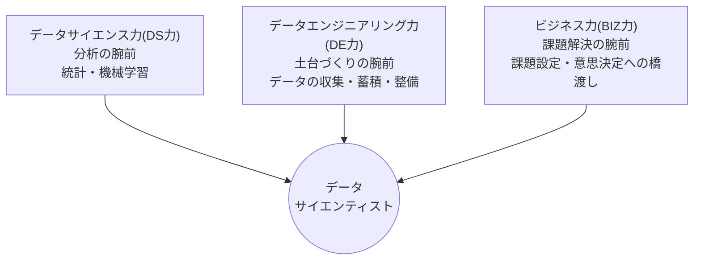

## このセクションで学ぶこと

- データサイエンティストに求められる3つの力(DS力・DE力・BIZ力)
- それぞれの力が仕事の中でどんな役割を果たすか
- 3つの力を1人で完璧にする必要はない、という現実的な見方

## データサイエンティストは「三刀流」

前のセクションで、データ分析が私たちの生活を支えていることを見ました。では、その分析を仕事にしているデータサイエンティストとは、どんな人なのでしょうか。

日本のデータサイエンティスト協会は、データサイエンティストに必要な力を3つに整理しています。この3つはDS検定でも土台になっている、とても大事な枠組みです。

- **データサイエンス力(DS力)** — 統計や機械学習といった手法を使いこなして、データから意味や答えを引き出す力。いわば「分析の腕前」です。
- **データエンジニアリング力(DE力)** — データを集め、蓄え、分析に使える形に整え、それを仕組みとして動かし続ける力。いわば「土台づくりの腕前」です。
- **ビジネス力(BIZ力)** — そもそも何を解決すべきかという課題を見つけて整理し、分析の結果を実際の行動や意思決定につなげる力。いわば「課題解決の腕前」です。

データサイエンティストとは、この3つが重なるところで働く「三刀流」の専門家、というイメージです。

## 具体例 — コンビニの売上改善を3つの力で見る

3つの力がどう働くのか、コンビニチェーンの「お弁当の売れ残りを減らしたい」というプロジェクトで見てみましょう。

まず**BIZ力**の出番です。「売れ残りを減らす」と一口に言っても、値引きのタイミングの問題なのか、仕入れの量の問題なのか、課題のとらえ方はいろいろです。現場の話を聞き、「天気や曜日に合わせて仕入れ量を調整できていないことが原因ではないか」と課題を絞り込みます。

次に**DE力**です。各店舗のレジの販売記録、気象データ、近隣のイベント情報など、バラバラの場所にあるデータを集めて、分析できるひとつの形に整えます。

そして**DS力**です。整えられたデータを分析し、「雨の日は駅前店のお弁当が2割売れ残りやすい」といった傾向を見つけ、天気予報から仕入れ量を予測する仕組みを作ります。

最後にもう一度**BIZ力**が働きます。分析結果を発注担当者に分かる言葉で伝え、実際の発注ルールを変えてもらう。ここまでやって、はじめて売れ残りが減るのです。

## 注意点 — 1人で全部できなくていい

3つも力が要ると聞くと、「そんなスーパーマンになれる気がしない」と思うかもしれません。安心してください。実際の現場では、分析が得意な人、データ基盤づくりが得意な人、ビジネスの橋渡しが得意な人がチームを組み、互いの得意分野で補い合うのが普通です。

ただし、どれか1つが完全にゼロだと会話が成り立ちません。だからこそDS検定のようなリテラシーレベルの学びでは、3つの領域を広く浅く見渡すことが重視されています。この教材も同じ考え方で作られています。

## まとめ

- データサイエンティストにはDS力(分析)・DE力(土台づくり)・BIZ力(課題解決)の3つの力が求められます。
- 1つのプロジェクトの中で、3つの力はバトンをつなぐように順番に働きます。
- 3つすべてを1人で極める必要はなく、チームで補い合うのが現実的です。
