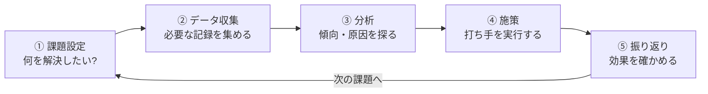

## このセクションで学ぶこと

- データ分析プロジェクトの基本の流れ(課題設定→データ収集→分析→施策→振り返り)
- 「データがあるから分析する」ではなく「課題があるから分析する」という順序
- 分析が一度きりで終わらず、サイクルとして回り続けること

## 出発点はデータではなく「課題」

データ分析と聞くと、「まず大量のデータを集めて、そこから何かすごい発見をする」という順番をイメージしがちです。しかし実際のプロジェクトは逆で、**最初に決めるのは「何を解決したいか」という課題**です。

前のセクションで見たBIZ力の話を思い出してください。データサイエンティストの仕事は、「解約を減らしたい」「売れ残りを減らしたい」といった具体的な困りごとから始まります。課題が決まってはじめて、「それを調べるにはどんなデータが要るか」が決まり、集める→分析する→手を打つ、という流れが動き出します。

基本の流れはこうです。

## 具体例 — 動画配信サービスの「解約を減らしたい」

この流れを、動画配信サービスの例でたどってみましょう。

1. **課題設定**: 「最近、解約する会員が増えている。解約率を下げたい」。ここで「どんな人が解約しやすいのかが分かれば、先回りして引き留められるはず」と、分析で答えるべき問いに置き換えます。
2. **データ収集**: 会員の視聴履歴、ログインの頻度、契約プラン、解約した日などの記録を集めます。
3. **分析**: データを眺めると、「解約する人は、その1か月ほど前からログイン回数がぐっと減る」という傾向が見つかりました。
4. **施策**: そこで、ログインが減ってきた会員に「あなたにおすすめの新着作品」の通知を送る、という打ち手を実行します。
5. **振り返り**: 通知を送ったグループと送らなかったグループで解約率を比べ、効果があったかを確かめます。効果が薄ければ、課題のとらえ方や打ち手を見直して、もう一周します。

このように、分析は⑤で終わりではなく、振り返りの結果が次の課題設定につながる**サイクル**として回り続けます。

## 注意点 — 「とりあえずデータを集める」は迷子のもと

ありがちな失敗が、課題を決めずに「とりあえずデータがあるから何か分析してみよう」と始めてしまうことです。目的がないままデータを眺めても、「で、これをどうするの?」という結果しか出てきません。集めるべきデータも絞れず、時間ばかりが過ぎていきます。

もうひとつの落とし穴は、③の分析で「面白い傾向が見つかった」ことに満足して、④の施策まで進まないことです。前のセクションで見たとおり、分析は判断や行動につながってはじめて価値になります。「分析して終わり」にしない、という視点はこの教材全体で何度も出てくるので、覚えておいてください。

## まとめ

- 分析プロジェクトは「課題設定→データ収集→分析→施策→振り返り」の流れで進みます。
- 出発点はデータではなく課題。「何が分かれば行動を変えられるか」から考えます。
- 分析は一度きりではなく、振り返りを次の課題につなげるサイクルとして回します。
