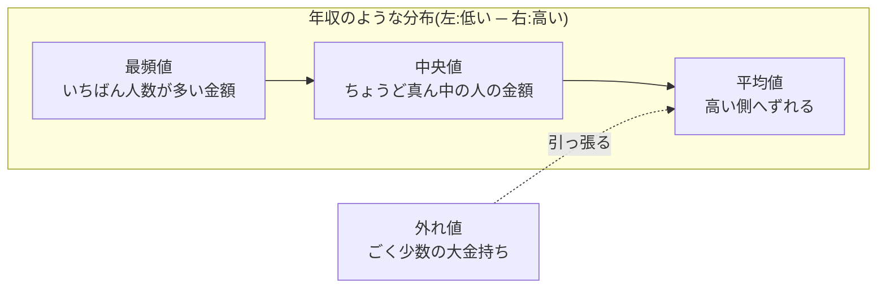

## このセクションで学ぶこと

- たくさんの数字を1つの数字で要約する「代表値」という考え方
- 平均値・中央値・最頻値という3つの代表値の意味と違い
- 外れ値があると平均値が実感とズレる理由と、使い分けの目安

## データを「ひとこと」で語りたい

「うちのお店のお客さん、1回あたりいくらくらい使ってるの?」と聞かれたとき、1,000人分の購入金額を全部読み上げるわけにはいきません。だれでも知りたいのは「だいたい、このくらい」という1つの数字です。このように、データ全体の特徴を1つの数値で表したものを **代表値** と呼びます。

代表値の求め方は1つではありません。よく使われるのは次の3つです。

- **平均値**: 全部足して、個数で割る。いちばんおなじみの代表値です
- **中央値**: データを小さい順に並べて、ちょうど真ん中にくる値
- **最頻値**: データの中でいちばん多く登場する値

「代表」の決め方が3通りある、と考えるとイメージしやすいでしょう。多数決で決めるのが最頻値、真ん中の人に代表してもらうのが中央値、全員の分をならして決めるのが平均値です。

## 具体例 — 5人の村の「平均年収」

小さな村に5人が住んでいて、年収がそれぞれ 300万円・350万円・400万円・450万円・3,000万円だったとします。

- **平均値**: 合計4,500万円 ÷ 5人 = **900万円**
- **中央値**: 小さい順に並べて3番目の **400万円**

「平均年収900万円の村」と聞くと、かなり裕福な村を想像しますよね。でも実際には、5人のうち4人は年収450万円以下です。たった1人の大金持ち、つまり **外れ値** が平均値を大きく引っ張り上げているのです。この村の暮らしぶりを表す数字としては、中央値の400万円のほうがずっと実感に近いはずです。

これは作り話ではなく、実際の年収データでも起きています。年収のように「ごく一部だけ極端に高い値がある」データでは、平均値は中央値よりも高くなりがちです。ニュースで「平均給与」を見て「自分の周りはそんなにもらっていない気がする」と感じるのは、まさにこの現象です。

では最頻値はいつ使うのでしょうか。たとえば靴屋さんで「今月いちばん売れたサイズは25.5cm」と言うとき、これが最頻値です。サイズの平均を取って「売れ筋は25.31cm」と言われても仕入れには使えませんよね。「いちばん多いのはどれか」がそのまま知りたいときは、最頻値が活躍します。

## 注意点 — 「どれが正しい」ではなく「何を知りたいか」

3つの代表値に優劣はありません。大事なのは目的との相性です。

- 世帯の暮らしぶりや給与の相場感なら、外れ値に強い **中央値**
- 売上の合計を人数で割り戻すような計算なら **平均値**(平均 × 人数 = 合計に戻せるのは平均だけです)
- 「いちばん多いのはどれか」をそのまま知りたいなら **最頻値**

そして、レポートや記事で「平均」という言葉を見かけたら、「外れ値に引っ張られていないかな? 中央値だとどうなるだろう?」と一歩引いて考える習慣をつけましょう。これだけで、数字にだまされにくくなります。

## まとめ

- 代表値はデータをひとことで語る数字で、平均値・中央値・最頻値の3つが基本
- 外れ値があると平均値は実感からズレる。年収のようなデータでは中央値が実感に近い
- どれが正しいかではなく、「何を知りたいか」で代表値を使い分ける
