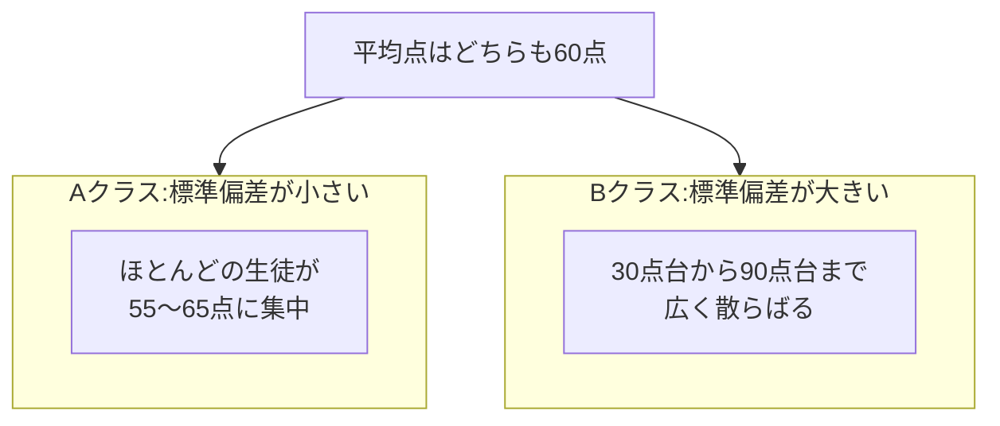

## このセクションで学ぶこと

- 平均が同じでも、中身がまったく違うデータがあること
- 標準偏差が「平均からの離れ具合(ばらつき)」を表すこと
- 平均とばらつきをセットで見る習慣が実務でなぜ大事か

## 平均60点のクラス、実はふたとおり

AクラスとBクラス、どちらも数学のテストの平均点は60点でした。「同じくらいの学力のクラスだな」と思いますよね。ところが答案を見ると、中身はまるで違いました。

- **Aクラス**: ほとんどの生徒が55〜65点。全員が平均の近くに集まっている
- **Bクラス**: 90点台の生徒と30点台の生徒に、くっきり分かれている

平均点という1つの数字では、この違いはまったく見えません。もしあなたが先生なら、Aクラスでは全体を底上げする授業を、Bクラスではつまずいている生徒への個別フォローを考えるはずです。**平均が同じでも、打つべき手は正反対になりうる**のです。

この「データが平均のまわりにどれくらい散らばっているか」を **ばらつき** と呼びます。

## ばらつきを1つの数字にする — 標準偏差

ばらつきの大きさを数字で表したものが **標準偏差** です。むずかしい計算式を覚える必要はありません。「**各データが平均からどれくらい離れているか、その平均的な距離**」だと思えば十分です。

- 標準偏差が **小さい** = データが平均のまわりに **ぎゅっと集まっている**(Aクラス)
- 標準偏差が **大きい** = データが平均から **広く散らばっている**(Bクラス)

似た言葉に **分散** があります。これも「ばらつきの大きさ」を表す値で、標準偏差を2乗したものにあたります。統計の本では計算の途中でまず分散が登場するのですが、この教材では「どちらもばらつきの指標で、日常の感覚に合わせて使いやすいのは標準偏差のほう」と押さえておけば大丈夫です。標準偏差なら「点数のばらつきが約5点分」のように、元のデータと同じ単位で語れるからです。

## 具体例 — 平均が同じでも「安心感」が違う

出前アプリで、配達時間の平均がどちらも30分の店が2軒あったとします。1軒は毎回だいたい28〜32分で届く店(標準偏差が小さい)、もう1軒は10分で来ることもあれば1時間かかることもある店(標準偏差が大きい)。お昼休みに注文するなら、選びたいのは前者ですよね。**ばらつきの小ささは「安定感・安心感」そのもの**なのです。

同じ発想は色々な場面に出てきます。工場では製品のサイズのばらつきが小さいほど品質が高いとされますし、金融の世界では値動きのばらつき(標準偏差)を「リスク」と呼んで、投資判断の材料にしています。

## 注意点 — 平均を見たら「ばらつきは?」と聞く

実務でのいちばんの活かし方は、計算ではなく問いかけです。会議で「平均〇〇です」という報告を聞いたら、「**ばらつきはどのくらいですか?**」と一言添えてみてください。平均のかげに二極化(Bクラスのような状態)が隠れていないかを確かめるだけで、判断の質が変わります。

また、標準偏差の数値を単独で見て「大きい・小さい」を判断する必要はありません。同じ種類のデータどうしを比べて「こちらのほうがばらつきが大きい」と相対的に使うのが基本です。そして前のセクションで見た外れ値は、平均だけでなく標準偏差も大きく引っ張ることを覚えておきましょう。

## まとめ

- 平均が同じでもばらつきが違えば、データの中身も打つべき手もまったく違う
- 標準偏差は「平均からの平均的な離れ具合」を表す、ばらつきの指標(分散もその仲間)
- 「平均は?」の次に「ばらつきは?」と聞く習慣が、数字を見る目を一段深くする
