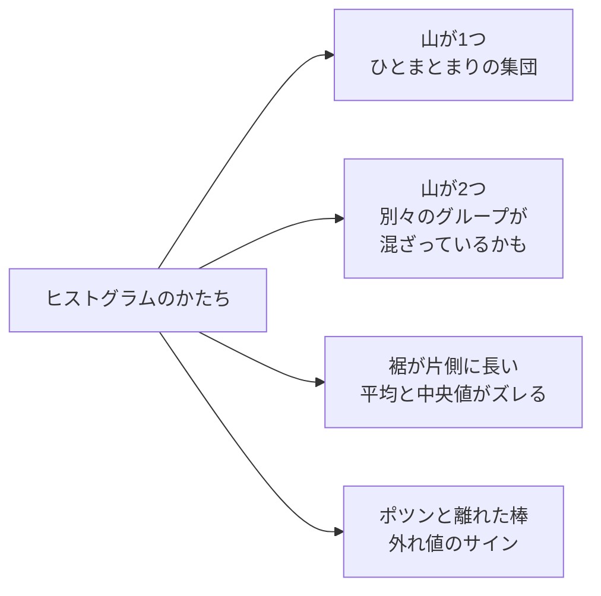

## このセクションで学ぶこと

- ヒストグラムがデータの「分布のかたち」を目で見る道具であること
- 山の数や左右の偏りから、データの背景を読み取る視点
- 棒グラフとの違いと、区間の幅で印象が変わる注意点

## 要約で捨てた情報を、目で取り戻す

ここまでで、平均や中央値などの代表値と、標準偏差というばらつきの指標を学びました。どちらもデータを少ない数字に要約する道具ですが、要約とは裏を返せば **情報を捨てること** です。捨てた情報の中に大事なヒントが隠れていることもあります。

そこで登場するのが **ヒストグラム** です。横軸に値の区間(**階級** と呼びます)、縦軸に「その区間に入るデータの個数」をとった図で、データがどのあたりに、どれくらい集まっているか — つまり **分布** の全体像を、ひと目で見せてくれます。数字の一覧をいくら眺めてもわからない「データのかたち」が、絵として浮かび上がるのです。

## かたちの読み方 — 3つの着眼点

ヒストグラムを読むときの着眼点は、たった3つ覚えれば十分です。

**1. 山はいくつあるか。** 山が1つなら、データはひとまとまりの集団です。山が2つあったら要注意で、**性質の違うグループが混ざっているサイン** かもしれません。たとえばカフェの来店時刻のヒストグラムに昼と夕方の2つの山があれば、「ランチ客」と「仕事帰り客」という別々の客層がいる、と読めます。

**2. 左右に偏っていないか。** 年収のデータは、右側(高い側)に裾が長く伸びたかたちになります。前のセクションで見たとおり、こういうかたちでは平均値が中央値より高い側にずれます。逆に、簡単だったテストの点数は高得点側に山ができて、左側に裾が伸びます。

**3. ポツンと離れた棒はないか。** 本体から離れた場所に孤立した棒があれば、外れ値のサインです。入力ミスなのか、それとも特別な優良顧客なのか — 原因を確かめる価値があります。

## 具体例 — 「平均来店時刻14時」のからくり

あるカフェで来店時刻の平均をとったら「14時」でした。では14時にスタッフを厚くすべきでしょうか? ヒストグラムを描いてみると、山は12時と17時の2つで、14時はむしろ谷底でした。平均は「2つの山のあいだ」という、実際にはお客さんが少ない時刻を指していたのです。代表値だけで判断せず、まずかたちを見ることの大切さがわかる例です。

## 注意点 — 区間の幅と、棒グラフとの違い

ヒストグラムは、階級の幅の取り方で印象が変わります。幅が細かすぎるとギザギザして傾向が見えず、粗すぎるとのっぺりして山が2つあっても1つに見えてしまいます。分析ツールが自動で決めてくれることも多いですが、「幅を変えると見え方が変わる」ことは頭に置いて、気になるときは幅を2〜3通り試すのがおすすめです。

また、見た目が似ている **棒グラフ** とは役割が違います。棒グラフは「商品A・B・C」のようなカテゴリごとの量を比べる図、ヒストグラムは1つの数値データの分布を見る図です。ヒストグラムの棒どうしがすき間なく並ぶのは、横軸が連続した数値の区間だからです。

## まとめ

- ヒストグラムは、代表値の要約で捨てた「分布のかたち」を目で取り戻す道具
- 山の数・左右の偏り・離れた棒の3点を見るだけで、データの背景が読めてくる
- 階級の幅で印象が変わることと、カテゴリ比較の棒グラフとの違いに注意する
