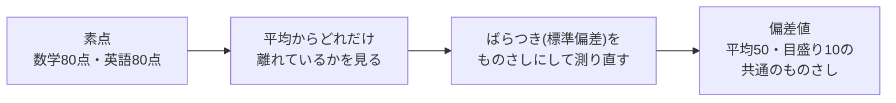

## このセクションで学ぶこと

- 正規分布が「平均を中心とした左右対称の釣鐘型」であること
- 平均と標準偏差の2つで、正規分布のおおよその範囲が語れること
- 偏差値が「ものさしを揃える(標準化)」の身近な例であること

## 世界でいちばん有名な「かたち」

前のセクションで、ヒストグラムには色々なかたちがあることを見ました。その中に、統計の世界でもっとも有名な定番のかたちがあります。**正規分布** です。平均のところにいちばん高い山があり、そこから左右対称に、なだらかな釣鐘(つりがね)型で裾が下りていくかたちをしています。

身長のデータ、工場で作る部品のサイズの誤差、何度も繰り返した測定のズレ — 自然や社会のさまざまなデータが、このかたちに近づくことが知られています。だからこそ統計学の中心に据えられ、「世界でいちばん有名な分布」と呼べる存在になりました。

正規分布のうれしい性質は、**平均と標準偏差の2つの数字だけで全体像が語れる** ことです。目安として、平均から標準偏差1つ分の範囲に全体の約68%、2つ分の範囲に約95%のデータが収まります。数字そのものを暗記する必要はありません。「平均と標準偏差さえわかれば『だいたいこの範囲に大半が収まる』と言える、便利なかたち」— この感覚だけ持ち帰ってください。

## 偏差値 — 全員が経験した「標準化」

この性質を使った、日本人にいちばん身近な統計の道具が **偏差値** です。

数学で80点、英語でも80点を取ったとします。どちらも同じくらい「すごい」のでしょうか? もし数学の平均が50点で、英語の平均が75点だったら、同じ80点でも意味はまったく違いますよね。さらに、点数のばらつき(標準偏差)が大きいテストでの「平均+30点」と、ばらつきが小さいテストでの「平均+30点」も、価値が違います。素点のままでは、ものさしがバラバラで比べられないのです。

そこで、**どのテストでも「平均を50、標準偏差1つ分を10」と数え直す** ことにしたのが偏差値です。

- 偏差値50 = ちょうど平均
- 偏差値60 = 平均より標準偏差1つ分だけ上(正規分布に近ければ、上位およそ16%)
- 偏差値40 = 平均より標準偏差1つ分だけ下

このように、単位も平均もばらつきも違うデータを共通のものさしに揃え直すことを **標準化** と呼びます。データ分析の現場でも、身長と年収のように単位の違うデータを一緒に扱う前に標準化する、という場面がよく出てきます。偏差値を知っているあなたは、実はすでに標準化を体験済みなのです。

## 注意点 — 万能のかたちではない

気をつけたいのは、**世の中のデータがすべて正規分布になるわけではない** ことです。年収は右に裾が長いかたちでしたし、カフェの来店時刻は山が2つでした。「約68%・約95%」という目安は正規分布に近いときの話なので、まずヒストグラムでかたちを確かめる、という前セクションの習慣がここでも効いてきます。

また、偏差値は「その集団の中での位置」を表す相対的な値です。全国模試の偏差値60と、少人数の校内テストの偏差値60では意味が違います。偏差値を見るときは「どの集団の中での話か」を確かめるようにしましょう。

## まとめ

- 正規分布は平均を中心とした左右対称の釣鐘型で、平均と標準偏差だけで全体像を語れる
- 偏差値は「平均50・標準偏差1つ分=10」に揃え直した値で、標準化の身近な例
- すべてのデータが正規分布とは限らない。まずヒストグラムでかたちを確かめる
