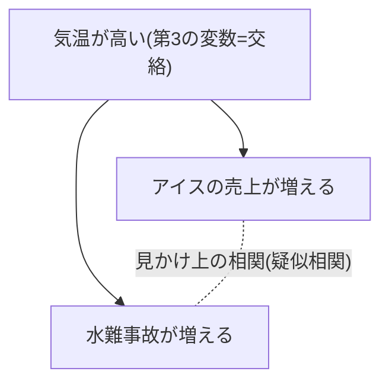

## このセクションで学ぶこと

- 相関関係と因果関係は別物で、相関だけでは「原因」はわからない
- 第3の変数(交絡)が、関係のない2つのデータに見かけの相関を生むことがある
- 相関を見つけたら「偶然では? 逆では? 第3の変数では?」と疑う習慣をつける

## アイスが売れると、水の事故が増える?

データ分析の世界には、有名な例があります。「アイスクリームの売上」と「水難事故の件数」を月ごとに集めて散布図にすると、きれいな正の相関が現れるのです。アイスが売れる月ほど、水の事故も多い。

では、「アイスを食べると人は溺れやすくなる」のでしょうか? もちろん違いますね。あるいは「水難事故のニュースを見るとアイスが食べたくなる」のでしょうか? それも変です。

種明かしはシンプルです。両方の背後に「気温」がいます。気温が高くなる夏には、アイスもよく売れるし、海やプールに行く人が増えて水難事故も増える。アイスと水難事故は、お互いに影響し合っているのではなく、同じ原因に引っ張られて一緒に動いていただけなのです。

## 因果関係と疑似相関

「一方が原因となって、もう一方の結果を引き起こしている」関係を **因果関係** と呼びます。一方、アイスと水難事故のように、直接の因果関係がないのに相関だけが現れる現象を **疑似相関** と呼びます。そして、両方に影響を与えている「気温」のような第3の変数のはたらきを **交絡** といいます(その変数を交絡因子と呼ぶこともあります)。

前のセクションで学んだ相関係数がどれだけ +1 に近くても、それが教えてくれるのは「一緒に動いている」という事実だけです。「なぜ一緒に動いているのか」までは教えてくれません。ここが、データを読むうえでいちばん転びやすい段差です。

## 身近な例で考える

疑似相関は、教科書の中だけの話ではありません。

たとえば「朝食を毎日食べる子どもは成績が良い」という調査結果があったとします。「朝食を食べさせれば成績が上がる」と結論づけたくなりますが、朝食の習慣がある家庭は、生活リズムや学習環境も整っていることが多いかもしれません。その場合、成績を押し上げているのは朝食そのものではなく、家庭環境という第3の変数の可能性があります。

ビジネスでも同じです。「アプリの通知をオンにしているユーザーほど購入額が多い」というデータから「通知を増やせば売上が伸びる」と飛びつくのは危険です。もともとそのサービスが好きな人ほど、通知もオンにするし、たくさん買ってもいる——そんな構図かもしれないからです。

## 注意点 — 3つの問いを自分に投げる

ニュースや広告で「〇〇する人ほど△△」という表現に出会ったら、結論に飛びつく前に次の3つを自問してみてください。

- **偶然では?** — データの数が少ないと、たまたま相関が出ることがあります
- **逆では?** — 原因と結果の向きが逆かもしれません(例:「売れているから広告を増やした」のに「広告のおかげで売れた」と読んでしまう)
- **第3の変数では?** — アイスと水難事故のように、背後に交絡が隠れていないか

なお、因果関係を本気で確かめたいときは、条件をそろえた2つのグループを比べる実験(Webの世界では A/Bテストと呼ばれます)のような方法が使われます。詳細には立ち入りませんが、「因果の確認には、相関を眺める以上のひと手間が必要」ということだけ覚えておけば十分です。

## まとめ

- 相関は「一緒に動いている」事実だけを示し、原因までは教えてくれません
- 気温のような第3の変数(交絡)が、疑似相関を生むことがあります
- 相関を見たら「偶然・逆・第3の変数」の3つを疑うのがリテラシーの基本です
