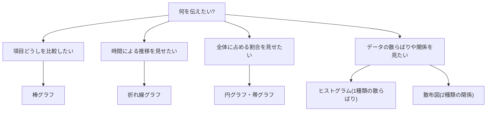

## このセクションで学ぶこと

- グラフには種類ごとに得意な役割があり、「何を伝えたいか」で選ぶ
- 比較は棒グラフ、推移は折れ線グラフ、割合は円グラフ・帯グラフが基本
- 分布はヒストグラム、2つのデータの関係は散布図で見る

## グラフ選びは「伝えたいこと」から始まる

ここまでのセクションで、散布図やヒストグラムといったグラフが何度も登場しました。実は、グラフにはそれぞれ「得意な仕事」があります。グラフ選びで最初に考えるべきことは、「どのグラフがかっこいいか」ではなく、「自分は何を伝えたいのか」です。

伝えたいことは、だいたい次の4つに整理できます。**比較**(どれが大きい?)、**推移**(どう変わってきた?)、**割合**(内訳はどうなっている?)、そして**分布・関係**(データはどう散らばっている? 2つのデータはつながっている?)です。この4つとグラフの対応さえ覚えれば、グラフ選びで迷うことはほとんどなくなります。

## 4つの役割とグラフの対応

**比較なら棒グラフ**です。店舗ごとの売上、商品ごとの販売数のように、項目どうしの大きさを比べたいときに使います。棒の長さがそのまま量を表すので、どれが多くてどれが少ないかが一目瞭然です。

**推移なら折れ線グラフ**です。月ごとの売上、年ごとの人口のように、時間の流れにそった変化を見せたいときに使います。線の傾きが「増えているのか、減っているのか、横ばいなのか」を直感的に伝えてくれます。

**割合なら円グラフか帯グラフ**です。アンケートの回答の内訳、売上に占める商品カテゴリの構成比など、「全体を100%としたときの内訳」を見せたいときに使います。円グラフはひとつの内訳を見せるのに向き、帯グラフは「今年と昨年」「20代と50代」のように複数の内訳を並べて比べるのに向きます。

**分布と関係なら、ヒストグラムと散布図**です。テストの点数が全体としてどう散らばっているかを見たいならヒストグラム(第2章で登場しました)、気温と売上のように2つのデータの関係を見たいなら散布図(このセクションの直前で学びました)です。

## 具体例 — 同じデータでも見せ方は変わる

たとえばあなたがカフェの店長で、1年分の売上データを持っているとします。「月ごとの売上の変化」を上司に見せるなら折れ線グラフ、「ドリンク・フード・グッズの売上構成」を見せるなら円グラフ、「3店舗の年間売上の比較」なら棒グラフ、「気温と売上の関係」を探るなら散布図。同じ売上データでも、伝えたいことが変われば選ぶグラフも変わるのです。

## 注意点 — ありがちなミスマッチ

グラフ選びでよくあるつまずきを2つだけ挙げておきます。

1つ目は、**円グラフに項目を詰め込みすぎる**ことです。項目が7つも8つもある円グラフは、扇形が細かくなりすぎて読み取れません。項目が多いときは、棒グラフや帯グラフに切り替えるほうが親切です。

2つ目は、**棒グラフとヒストグラムの混同**です。見た目は似ていますが、棒グラフは「別々の項目の比較」、ヒストグラムは「1種類のデータの散らばり」を見るもので、役割はまったく違います。

## まとめ

- グラフは「何を伝えたいか」(比較・推移・割合・分布/関係)で選びます
- 比較は棒グラフ、推移は折れ線グラフ、割合は円グラフ・帯グラフです
- 散らばりはヒストグラム、2つのデータの関係は散布図が担当します
