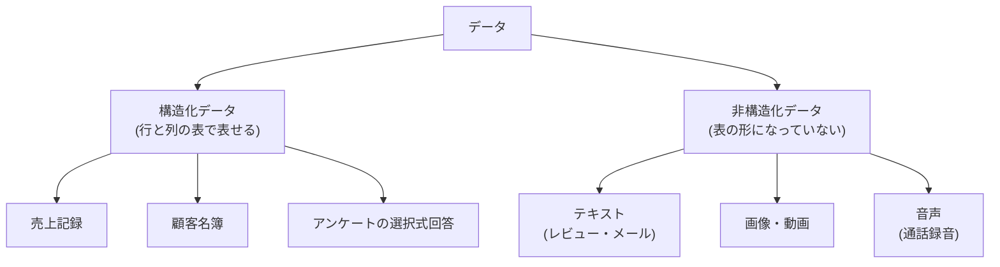

## このセクションで学ぶこと

- 構造化データと非構造化データという 2 つの大分類
- データを集める代表的な方法と、それぞれの入手先
- 「どう集めたか」がデータのクセを決めるという視点

## データには「表になっているもの」と「なっていないもの」がある

分析の話をするとき、多くの人が思い浮かべるのは Excel のような「表」ではないでしょうか。行と列がきちんと決まっていて、1 行が 1 件の記録、1 列が 1 つの項目(日付・商品名・金額など)になっているデータ。これを**構造化データ**と呼びます。売上記録、顧客名簿、アンケートの選択式回答などが代表例で、そのまま集計や計算ができるため、分析ととても相性が良いデータです。

一方で、世の中のデータの大半は表の形をしていません。商品レビューの文章、問い合わせメール、SNS の投稿、写真、コールセンターの通話録音、監視カメラの映像。こうした表に収まらないデータを**非構造化データ**と呼びます。そのままでは平均を出したりグラフにしたりできないため、分析するには「文章から評価の高い・低いを数値化する」など、何らかの形で構造化データに変換する工夫が必要になります。

## データはどこから集めてくるのか

では、分析に使うデータはどこから来るのでしょうか。代表的な入手先を 5 つ挙げます。

- **業務システム**: 販売管理システムやレジ(POS)など、日々の仕事の中で自動的に記録されるデータです。企業のデータ分析では最も基本的な入手先です。
- **ログ**: Web サイトの閲覧履歴やアプリの操作履歴のように、人がボタンを押したり画面を見たりするたびに自動で残る記録です。量が膨大になるのが特徴です。
- **アンケート**: 知りたいことを直接質問して集めるデータです。「満足度」のようにシステムには残らない気持ちを聞ける反面、答えてくれた人しかデータに含まれません。
- **オープンデータ**: 政府や自治体が公開している統計データです。国の統計サイト(e-Stat など)から、人口や物価などのデータを誰でも無料で入手できます。
- **Web 上の情報**: Web ページから情報を収集する方法(スクレイピングと呼ばれます)や、サービスが公式に提供するデータの窓口(API)を通じて集める方法があります。

## 注意点 — 集め方がデータのクセを決める

大事なのは、**どう集めたかによってデータの性質やクセが変わる**ことです。たとえばアンケートは「わざわざ答えてくれた人」に偏りますし、ログには「なぜそう操作したのか」という理由までは残りません。業務システムのデータも、入力する人が空欄のまま登録すれば、その項目は欠けたままになります。データを見るときは「これはどこから、どうやって集められたものか?」と一度立ち止まって考える習慣が、分析の第一歩になります。

## まとめ

- データは表形式の構造化データと、テキスト・画像・音声などの非構造化データに大きく分けられる
- 入手先には業務システム・ログ・アンケート・オープンデータ・Web などがある
- 集め方によって偏りや欠けなどのクセが生まれるため、「どう集めたか」を意識することが大切
