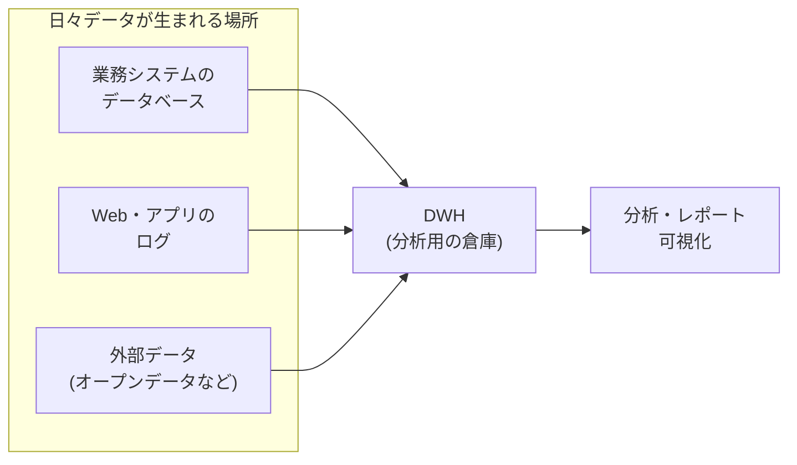

## このセクションで学ぶこと

- データベースとは何か — データの「貯蔵庫」のイメージ
- 業務用のデータベースと、分析用の DWH の役割の違い
- クラウドという「借りる」選択肢が標準になっていること

## データベース — データを整理して貯めておく仕組み

この章ではここまで、データの集め方と整え方を見てきました。最後に「集めたデータはどこに置かれているのか?」という話をします。難しい技術には踏み込みません。「どんな場所があるか」の地図だけ持ち帰ってください。

まず**データベース**です。これは、データを整理して貯めておき、必要なときにすばやく取り出せるようにした仕組みのことです。ネットショップで買い物をすると、注文情報は瞬時に記録され、後から「注文履歴」として呼び出せますね。あの裏側で動いているのがデータベースです。図書館が本をバラバラに積まず、分類して棚に並べているからすぐ探せるのと同じで、データベースもルールに従ってデータを格納しています。

なお、データベースから「この条件のデータをください」と問い合わせるための言語を **SQL** と呼びます。文法はこの教材では扱いませんが、データ分析の現場で毎日のように使われる道具なので、名前だけ覚えておくと今後の学習で役立ちます。

## DWH — 分析のための「データの倉庫」

ここで 1 つ疑問が出ます。会社にはデータベースがすでにあるのだから、そこで直接分析すればよいのでは? 実は、業務用のデータベースは「注文を 1 件ずつ確実に記録する」ことに最適化されていて、「過去 3 年分をまとめて集計する」ような重い分析には向いていません。分析のために大量の読み出しをかけると、本業のシステムが遅くなってしまう恐れもあります。

そこで登場するのが **DWH(データウェアハウス)** です。ウェアハウスは「倉庫」という意味で、販売システム・会員システム・Web のログなど、社内のあちこちに散らばったデータを分析用に 1 か所へ集めて整理した場所を指します。日々の業務を支えるデータベースが「店頭の棚」なら、DWH は「分析のために全店舗の在庫を集めた巨大倉庫」というイメージです。

## クラウド — 置き場所は「買う」から「借りる」へ

最後に**クラウド**です。かつてはデータベースや DWH を動かすために、会社が自前でコンピュータ(サーバー)を買って管理していました。今は、インターネット越しに必要な分だけ借りて使うのが主流です。これがクラウドで、Amazon・Google・Microsoft などが大規模なサービスを提供しています。

写真を自分のスマホ本体ではなくインターネット上に保存しておけば、容量を気にせず、どの端末からも見られますよね。企業のデータも同じで、クラウドなら大量のデータを柔軟に貯め、必要なときだけ強力な計算力を借りて分析できます。

## 注意点 — 名前より「役割」で覚える

このセクションには言葉がたくさん出てきましたが、暗記する必要はありません。押さえてほしいのは役割です。「日々の記録を支えるのがデータベース」「分析のために集めた倉庫が DWH」「それらを借りて動かす場所がクラウド」。この 3 つの役割のイメージがあれば、実務の会話やニュースに出てきたときに迷子にならずに済みます。

## まとめ

- データベースは、データを整理して貯め、すばやく取り出せるようにした仕組み
- DWH は、社内に散らばるデータを分析のために 1 か所へ集めた「倉庫」
- クラウドは置き場所や計算力を「借りて使う」仕組みで、いまのデータ分析の標準的な環境
