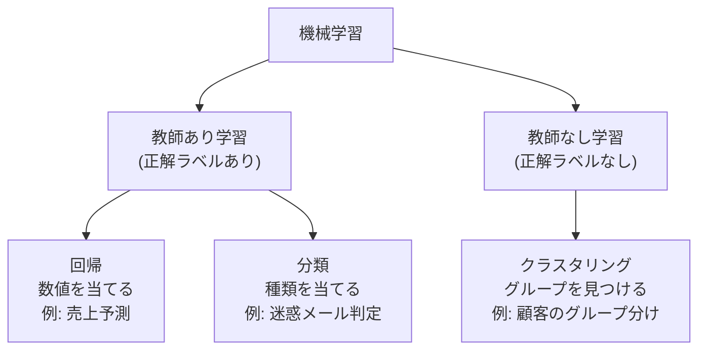

## このセクションで学ぶこと

- 「ルールを人が書く」従来のやり方と「データから規則を見つける」機械学習の違い
- 教師あり学習と教師なし学習という、2つの大きな学び方の区別
- 機械学習は魔法ではなく、データ分析の道具のひとつだということ

## ルールを人が書く、という限界

コンピュータに仕事をさせる伝統的な方法は、「人がルールを書く」ことです。たとえば迷惑メールを振り分けたいなら、「件名に『無料』が入っていたら迷惑メール」「知らないアドレスからの添付ファイル付きは迷惑メール」といった条件を、人が1つずつ考えて書いていきます。

このやり方は、ルールが少ないうちはうまくいきます。しかし迷惑メールの手口は日々変わりますし、「無料」と書いてある普通のメールもあります。ルールが増えるほど例外も増え、人手での管理はすぐに限界を迎えます。

## データから規則を見つける、という発想

そこで発想を逆転させたのが**機械学習**です。人がルールを書くのではなく、大量のデータをコンピュータに見せて、**規則やパターンのほうをデータから見つけさせる**のです。

迷惑メールの例なら、「これは迷惑メール」「これは普通のメール」と印を付けたメールを何万通も見せます。するとコンピュータは、「こういう特徴のメールは迷惑メールらしい」という規則を自分で見つけ出します。こうしてできた規則のかたまりを**モデル**と呼び、新しく届いたメールの判定に使います。

第4章で見たように、データ分析の主役はあくまでデータでした。機械学習も同じで、良いデータをきちんと整えて与えることが出発点になります。その意味で、機械学習は「データ分析の道具箱に入っている、予測が得意な道具のひとつ」と捉えるのがちょうどよい距離感です。

## 2つの学び方 — 教師あり・教師なし

機械学習の学び方は、大きく2つに分かれます。分かれ目は「**正解ラベルのあるデータを使うかどうか**」です。

- **教師あり学習**: 「問題と正解」のペアを見せて学ばせる方法です。迷惑メール判定のように、「このメールは迷惑メール(正解)」というラベル付きデータから規則を学びます。正解を教えてくれる先生(教師)がいるイメージです。
- **教師なし学習**: 正解ラベルのないデータから、データ自体の構造を見つけさせる方法です。たとえば顧客データを渡して「似た者同士でグループに分けて」と頼むような使い方で、何が正解かは事前に決まっていません。

図の下段にある「回帰」「分類」「クラスタリング」は、次のセクションから順番に見ていく代表的な手法です。この分岐マップが、本章全体の地図になります。

## 注意点 — 機械学習は魔法ではない

機械学習と聞くと「AIが何でも賢く判断してくれる」と思いがちですが、実際にやっているのは「**与えられたデータの中にあるパターンを見つける**」ことだけです。データに含まれていないことは学べませんし、偏ったデータからは偏った規則が生まれます。ちなみに、ニュースでよく聞くディープラーニングも機械学習の一種ですが、この教材では内部のしくみには立ち入らず、「道具として何ができるか」に絞って見ていきます。

## まとめ

- 機械学習は、人がルールを書く代わりに「データから規則を見つけさせる」技術です
- 正解ラベル付きデータで学ぶのが教師あり学習、ラベルなしで構造を見つけるのが教師なし学習です
- 機械学習は魔法ではなく、与えたデータの質に結果が左右されるデータ分析の道具のひとつです
