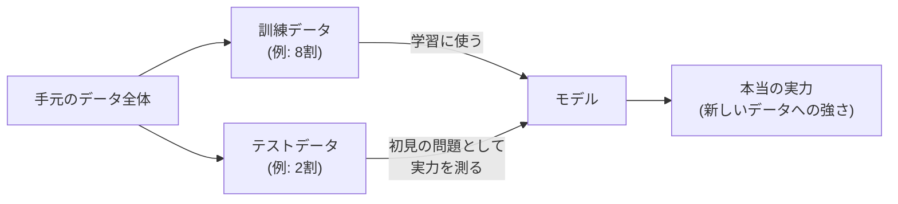

## このセクションで学ぶこと

- 訓練データとテストデータを分けて評価する理由
- 「丸暗記」で本番に弱くなる過学習という落とし穴
- 精度の数字だけを信じてはいけない、という健全な疑いの持ち方

## 作ったモデルは、必ず「試験」にかける

回帰・分類・クラスタリングと、機械学習の代表的な道具を見てきました。しかしモデルは作って終わりではありません。**そのモデルが本当に使えるかを確かめる「評価」**という工程が必ず必要です。

ここで大切なのが、手元のデータを**訓練データ**と**テストデータ**の2つに分けておくことです。訓練データはモデルに規則を学ばせるために使い、テストデータは学習には一切使わず、できあがったモデルの実力測定のために取っておきます。

なぜ分けるのでしょうか。学校の試験にたとえるとわかりやすくなります。授業で解いた問題(訓練データ)をそのまま試験に出したら、答えを覚えているだけの生徒でも満点が取れてしまい、本当に理解しているかはわかりません。実力を測るには、**授業で見せていない初見の問題(テストデータ)**を出す必要があるのです。モデルの目的は「過去のデータを言い当てること」ではなく「まだ見ぬ新しいデータを予測すること」なので、初見の問題での成績こそが本当の実力です。

## 過学習 — 丸暗記の秀才は本番に弱い

評価で見つけたい代表的な失敗が**過学習**です。過学習とは、モデルが訓練データの細かい特徴まで**丸暗記**してしまい、初見のデータに弱くなる状態を指します。

過去問の「答え」だけを丸暗記した受験生を想像してください。過去問なら満点ですが、数字を少し変えた問題が出た途端に解けなくなります。モデルも同じで、訓練データへの当てはまりを極端に追求すると、そのデータにたまたま含まれていた偶然の癖やノイズまで規則として覚え込んでしまいます。結果、訓練データでの成績は素晴らしいのに、テストデータでは成績がガクッと落ちる。この「訓練では好成績、初見で急落」というギャップこそが、過学習の典型的なサインです。

だからこそテストデータを分けておくことが効きます。もし全データで学習して全データで採点していたら、丸暗記モデルほど高評価になってしまい、過学習に気づけないのです。

## 注意点 — 「精度99%」を鵜呑みにしない

もうひとつ、評価の数字との付き合い方にも注意が必要です。モデルの良さはよく**精度**(予測が当たった割合)で語られますが、**精度の数字だけを信じるのは危険**です。

たとえば「迷惑メールを99%の精度で判定するモデル」と聞くと優秀に思えます。でも、もし届くメールのうち迷惑メールが1%しかないなら、**すべてのメールを「迷惑メールではない」と答えるだけの何もしないモデルでも精度99%**になってしまいます。肝心の迷惑メールは1通も見つけていないのに、です。

このように、数字が高くても目的を果たしていないモデルはあり得ます。実務では「何を見逃すと困るのか」「間違えたときの損害はどちらが大きいのか」という視点とセットで評価を眺めることが大切です。細かい指標の名前を覚える必要はまだありません。「精度が高い=使える、とは限らない」という健全な疑いを持てれば、この章のゴールとしては十分です。

## まとめ

- モデルの実力は、学習に使っていないテストデータという「初見の問題」で測ります
- 過学習は訓練データの丸暗記状態で、「訓練では好成績、初見で急落」がそのサインです
- 精度99%でも役に立たないモデルはあり得るので、数字は目的と照らして疑いながら読みましょう
