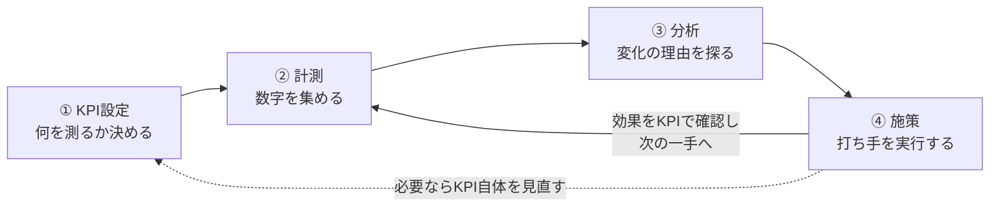

## このセクションで学ぶこと

- 分析の価値は、結果が意思決定と行動につながってはじめて生まれること
- 「何を測って良し悪しを判断するか」を決める物差しであるKPI
- KPI設定→計測→分析→施策と回り続けるデータドリブンなサイクル

## 分析の出口は「意思決定」

第1章で、データ分析は「課題設定→データ収集→分析→施策→振り返り」という流れで進むこと、そして出発点はデータではなく課題だということを学びました。最終章となるこの章では、その流れの「出口」に注目します。分析の結果は、誰かの判断と行動を変えてはじめて価値になるからです。

どんなに鮮やかな分析でも、報告書がフォルダに眠ったままでは、売上も顧客満足も1ミリも動きません。第1章で紹介した3つの力のうち、この出口を担当するのが**BIZ力(ビジネス力)**でした。この章は、いわばBIZ力の章です。

## KPI — 「何を測るか」を先に決める

分析を意思決定につなげるうえで要になるのが、**KPI(重要業績評価指標)**です。KPIとは、目標にどれだけ近づいているかを測るために選んだ、重要な数字の物差しのことです。

たとえば「お客さまに長く使ってもらえるサービスにしたい」という目標は、そのままでは漠然としていて、うまくいっているのか判断できません。そこで「毎月の解約率」をKPIに選べば、「先月は3%、今月は2.5%。施策が効いているようだ」と、数字で良し悪しを語れるようになります。

KPIが決まると、意思決定は次のようなサイクルとして回り始めます。仕事の進め方の型としてよく知られる**PDCAサイクル**(計画→実行→評価→改善)を、データを燃料にして回すイメージです。そして、勘や経験だけに頼らず、こうしてデータに基づいて判断や行動を決める姿勢を**データドリブン**と呼びます。

## 具体例 — 動画配信サービスの「その後」

第1章に登場した、動画配信サービスの解約を減らすプロジェクトのその後を見てみましょう。

このチームはKPIとして「月間の解約率」を設定しました。分析から「解約する人は、その前にログイン回数が減る」という傾向がわかっていたので、あわせて「会員のログイン頻度」も日々見張る数字に加えます。おすすめ通知の施策を実行したら、翌月の解約率がどう動いたかをKPIで確認する。効果が出ていればその施策を広げ、出ていなければ別の打ち手を試す。こうして「測る→分析する→打つ→また測る」が回り続けるのが、データドリブンな職場の日常です。

## 注意点 — 測りやすい数字が、大事な数字とは限らない

KPIには落とし穴もあります。**選んだ数字が目標とずれていると、行動のほうが数字に引っぱられてゆがんでしまう**のです。

たとえばアプリの成功を「ダウンロード数」だけで測ると、広告を大量に打ってダウンロード数を稼ぐことが目的化しがちです。ダウンロードされても一度も使われなければサービスとして成功していないのに、数字の上では絶好調に見えてしまいます。第5章で見た「精度99%でも役に立たないモデル」と同じで、**数字は目的と照らして疑いながら読む**姿勢がここでも大切です。KPIは一度決めたら終わりではなく、「この数字を追いかけることは、本当に目標に近づくことだろうか?」と定期的に見直しましょう。

## まとめ

- 分析の価値は、結果が意思決定と行動につながってはじめて生まれます。
- KPIは「何を測って良し悪しを判断するか」を決める物差しで、データドリブンなサイクルの起点です。
- 測りやすい数字が大事な数字とは限りません。KPIが目標とずれていないか、定期的に見直しましょう。
