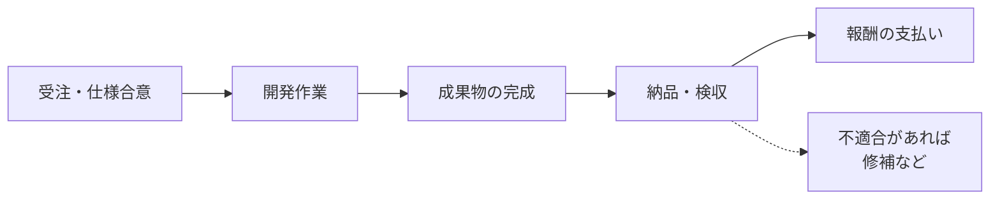

## このセクションで学ぶこと

- 請負契約では成果物の「完成」が報酬の前提になることを理解する
- 完成義務と契約不適合責任という二つの責任を区別できる
- 受託開発の多くが請負である理由と、その実務上の注意点を把握する

## 請負契約とは — 「完成」を約束する

**請負契約**は、仕事を引き受けた側(請負人)が**成果物を完成させて引き渡すこと**を約束し、それに対して発注者が報酬を支払う契約類型です。ポイントは、約束しているのが「作業をすること」ではなく「**完成という結果**」だという点にあります。

たとえば「ECサイトを構築して納品する」という案件を請負で受けた場合、エンジニア側はサイトを動く状態まで完成させる責任を負います。途中まで作業したという事実だけでは、原則として報酬を請求できません。あくまで完成した成果物を引き渡してはじめて、報酬の支払い条件が整います。この「完成させる義務」を**完成義務**と呼びます。

## 二つの責任 — 完成義務と契約不適合責任

請負契約で押さえておきたい責任は二つあります。一つは前述の**完成義務**、もう一つは引き渡した後に関わる**契約不適合責任**です。

完成して引き渡した成果物が、後から契約の内容に適合していなかった(たとえば仕様どおりに動かない、約束した機能が欠けている)とわかった場合、請負人は修補や代金の減額などの対応を求められることがあります。これが契約不適合責任です。つまり請負には「完成させるまで」と「引き渡した後」の両面で責任がつきまといます。

具体的な流れを整理すると、次のようになります。

完成して納品し、発注者の**検収**を経て報酬が支払われる、という流れが基本です。検収後に不適合が見つかれば、契約不適合責任に基づく対応が発生し得ます。

## 受託開発の多くが請負である理由と注意点

世の中の「受託開発」の多くは、この請負契約の形をとります。発注者からすれば「成果物が完成して受け取れる」という結果が保証されるため、安心して発注できるからです。

一方で、引き受ける側にとっては注意が必要です。完成させてはじめて報酬が発生するため、仕様が曖昧なまま作業を進めると「どこまで作れば完成なのか」が定まらず、終わりの見えない手戻りに陥りがちです。また、見積もりを超える工数がかかっても、完成義務がある以上は最後までやり遂げる必要が出てきます。

そのため請負では、**何をもって「完成」とするか**を契約や仕様書で明確にしておくことが実務上きわめて重要です。受け入れの基準が曖昧だと、発注者は「まだ完成していない」と考え、引き受けた側は「完成させた」と考える、というすれ違いが起きやすくなります。逆に、完成の条件と検収の手順を事前にそろえておけば、報酬の支払い時期も見通しやすくなります。なお、完成の定義や責任の範囲は個別の契約書の文言によって変わるため、最終的には契約書の内容で確認することが前提になります。

## まとめ

- 請負契約は「成果物の完成」を約束し、完成が報酬の前提となる。
- 完成義務に加え、引き渡し後の契約不適合責任も負う。
- 受託開発に多い形であり、「完成の定義」を明確にすることが重要。
