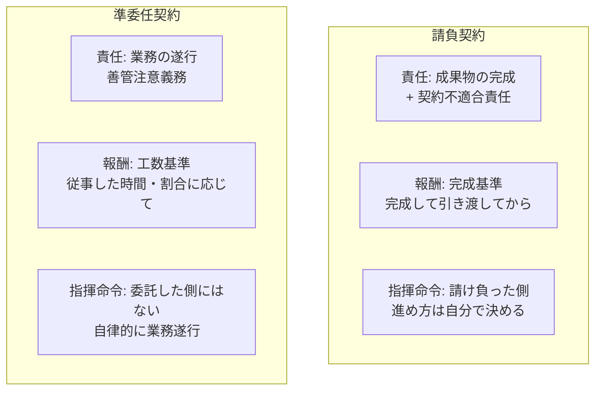

## このセクションで学ぶこと

- 請負と準委任を「責任・報酬・指揮命令」の三つの軸で対比できる
- 報酬の発生条件が完成基準か工数基準かを見分けられる
- 指揮命令の所在が契約類型でどう違うかを把握する

## 三つの軸で全体像を整理する

ここまで請負と準委任を個別に見てきました。最後に、両者を**責任・報酬・指揮命令**という三つの軸でまとめて対比し、頭の中の地図を完成させましょう。この三つを押さえておくと、後の章で出てくる SES や受託開発、業務委託の話も、この地図の上に置いて理解できるようになります。

## 軸ごとの違いを読み解く

**責任**の軸では、請負は「成果物の完成」とその後の契約不適合責任まで負うのに対し、準委任は「業務を誠実に遂行すること(善管注意義務)」が中心で、原則として完成義務を負いません。何に責任を負うのかが根本的に違う、という点がすべての出発点です。

**報酬**の軸では、請負は**完成基準**で、成果物を完成させて引き渡してはじめて報酬の条件が整います。一方、準委任の履行割合型は**工数基準**で、働いた時間や割合に応じて報酬が発生します。「途中で終わったら報酬はどうなるか」を考えると、両者の違いが実感しやすいでしょう。

**指揮命令**の軸も実務上とても重要です。請負も準委任も、業務の具体的な進め方は引き受けた側が自律的に決めるのが原則で、発注者がその場で逐一作業指示を出す関係(指揮命令)にはないと整理されます。この「指揮命令の所在」は、後の章で扱う SES や偽装請負を理解するうえでの鍵になります。

## 具体例で確かめる

たとえば「3か月でアプリを完成させて納品。完成後に報酬」という案件なら、責任は完成・報酬は完成基準・進め方は自分で決める、という請負型の特徴がそろいます。仮に途中で開発が中断すれば、完成していない以上は原則として報酬を請求しにくい、という結果になりがちです。一方「月160時間チームに参加して開発を担当。稼働時間で精算」という案件なら、責任は業務遂行・報酬は工数基準、という準委任型の特徴がそろいます。こちらは月ごとに働いた分の報酬が積み上がるため、案件が途中で終わってもそこまでの稼働分は精算されるのが基本です。

このように、案件の説明を聞いたときに「何に責任を負うのか」「報酬はいつ・何を基準に発生するのか」「進め方は誰が決めるのか」の三つを当てはめてみると、その仕事がどちらの土台に立っているかを見分けられます。

ただし、契約書のタイトルが「請負」でも中身は準委任に近い、といったこともあり得ます。最終的には呼び名ではなく契約書の中身と実態で判断される点に注意しておきましょう。次の章以降で扱う SES や業務委託も、この三つの軸に当てはめて読み解いていきます。

## まとめ

- 請負は「完成・完成基準」、準委任は「遂行・工数基準」と対比できる。
- 業務の進め方は、どちらも引き受けた側が自律的に決めるのが原則。
- 呼び名より中身と実態で判断される点に注意する。
