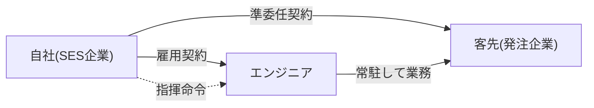

## このセクションで学ぶこと

- 客先常駐という働き方がどのようなものかを説明できる
- SES(準委任)における指揮命令権が原則として自社側にあることを理解する
- 雇用関係・契約関係・指揮命令の三者の関係を図で整理できる

## 客先常駐 — 働く場所と雇い主が分かれる

SESでよく見られる働き方が**客先常駐**です。エンジニアは自社(SES企業)に雇用されていますが、実際の勤務場所は契約先である客先のオフィスになります。つまり、「給料をもらう相手(雇用主)」と「日々顔を合わせて業務を行う場所」が分かれている、という状態です。

ここで混乱しやすいのが**指揮命令の所在**です。指揮命令とは、第1章でも触れたとおり、「この作業をこうやってください」と具体的に業務を指示する権限のことです。客先のオフィスで働いていると、つい客先の社員から直接指示を受けるのが当たり前のように感じられますが、SES(準委任)の建前では事情が異なります。

## 具体例 — 三者の関係を整理する

登場人物は三者です。エンジニア本人、エンジニアを雇用する自社(SES企業)、そして業務の場を提供する客先です。この関係を図にすると次のようになります。

ポイントは2つあります。第一に、エンジニアと**雇用契約**を結んでいるのはあくまで自社です。第二に、自社と客先のあいだにあるのは**準委任契約**であり、ここには雇用関係はありません。

そして最も重要なのが、**指揮命令は原則として自社(SES企業)側にある**という点です。準委任契約は「業務を遂行するサービス」を提供する契約なので、エンジニアへの具体的な業務指示は、本来は自社の責任者を通じて行われるのが筋とされています。客先は「こういう成果や進め方を期待します」と自社に伝え、自社がエンジニアに指示する、という流れが建前です。

## 注意点 — 建前と実態がずれやすい

実務では、客先のオフィスに常駐しているために、客先の社員がエンジニアへ直接こまかい指示を出してしまう場面が起こりがちです。たとえば、客先の担当者が「この機能の実装方法を変えてほしい」「明日までにこの作業をやっておいて」と、自社の責任者を介さずに直接指示するようなケースです。働いている本人からすると、目の前にいる客先の人から指示を受けるのは自然に感じられるため、ずれが生じていることに気づきにくいという特徴があります。

一般的な理解としては、準委任であるはずなのに客先が直接の指揮命令を行っている状態は、契約形態と実態がずれている可能性があり、後の章で扱う偽装請負の論点につながり得ます。ずれそのものの法的な評価には個別の事情をふまえた判断が必要なので、ここでは「そうした論点がある」という程度にとどめておきます。

大切なのは、登場人物それぞれの立場を切り分けて理解することです。「誰が雇用主か(自社)」「誰と誰のあいだに契約があるか(自社と客先)」「誰が指揮命令の権限を持つ建前か(原則として自社)」という三つの問いに分けて整理しておくと、現場で起きていることを冷静に捉えやすくなります。これがSESを正しく理解する第一歩です。

## まとめ

- 客先常駐は、雇用主(自社)と勤務場所(客先)が分かれる働き方です。
- SES(準委任)では、指揮命令権は原則として自社(SES企業)側にあります。
- 雇用は自社、契約は自社と客先のあいだ、という三者関係を切り分けて理解しましょう。
