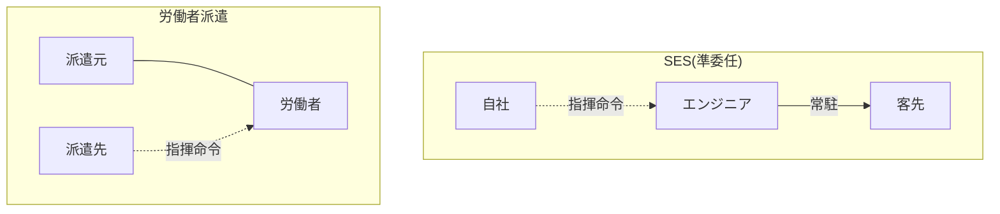

## このセクションで学ぶこと

- SESと労働者派遣の違いを指揮命令の所在の観点で説明できる
- SES(準委任)では成果物の完成義務が原則ないことを理解する
- 「SES=スキルが身につかない」などの俗説を実態と切り分けて捉えられる

## 誤解1 — 「SESは派遣と同じ」ではない

SESについて最も多い誤解が、「客先に常駐するのだから、結局は派遣と同じだろう」というものです。両者は「自社に雇用されつつ他社で働く」という見た目こそ似ていますが、契約の建前は大きく異なります。

最大の違いは**指揮命令の所在**です。前のセクションで見たとおり、SES(準委任)では指揮命令は原則として自社(SES企業)側にあります。一方、労働者派遣では、派遣先が派遣労働者に直接指揮命令を行うことが制度上認められています。

つまり「指揮命令を客先が直接行ってよいか」という点で、SESと派遣は別物です。労働者派遣はそのための制度(派遣に必要な許可など)が整っている前提で成り立っています。逆に言えば、SES(準委任)は派遣のような枠組みではないため、客先が直接の指揮命令を行うことを当然の前提とはしていません。見た目が似ているからといって同一視すると、誰が指示する建前なのかを取り違え、契約の理解を誤ってしまいます。

## 誤解2 — 「SESにも成果物の完成義務がある」わけではない

次に多い誤解が、成果物の扱いです。SESは準委任契約が基本なので、第1章で学んだとおり**完成義務は原則としてありません**。エンジニアが負うのは「業務を誠実に遂行すること」であって、「システムを必ず完成させること」ではありません。

もちろん実務では、客先と良好な関係を保つために成果を出そうと努力するのが自然です。しかし契約上の責任という意味では、請負のように「完成しなければ報酬が発生しない」「契約不適合があれば修補責任を負う」といった重い義務は、準委任のSESには基本的に当てはまりません。報酬は業務の遂行に対して支払われます。

## 誤解3 — 俗説と実態を切り分ける

「SESはスキルが身につかない」「SESは下流工程ばかり」といった俗説も耳にします。これらは契約形態そのものから必然的に導かれるものではなく、個々の案件内容や企業の方針によって大きく変わります。実際、上流の設計から関われる案件もあれば、運用・保守が中心の案件もあり、それは準委任という契約の性質ではなく、あくまでその案件で求められる業務の内容によって決まります。

ここで押さえておきたいのは、契約形態の特性(指揮命令の所在・報酬の条件)と、案件そのものの良し悪しは別の話だ、ということです。SESという言葉に一律のイメージを当てはめるのではなく、「この契約はどういう責任と報酬条件か」「この案件はどういう業務内容か」を分けて見ることが、冷静な判断につながります。

## まとめ

- SESと派遣の最大の違いは指揮命令の所在です(SESは原則自社、派遣は派遣先)。
- SESは準委任が基本なので、成果物の完成義務は原則としてありません。
- 「スキルが身につかない」等の俗説は案件次第であり、契約形態の特性とは切り分けて考えましょう。
