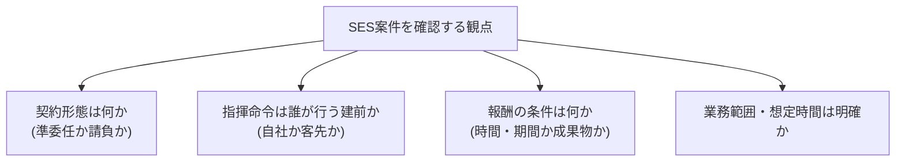

## このセクションで学ぶこと

- SESの案件で契約形態(準委任か否か)を確認する重要性を説明できる
- 指揮命令の所在や報酬条件など、事前に確認したい観点を挙げられる
- 確認した内容と実態のずれに気づくための視点を持てる

## SESを「言葉」で終わらせない

ここまで見てきたとおり、SESは俗称であり、その中身は契約書や実際の働き方で決まります。だからこそ、SESの案件に関わるときは「SESだから安心」「SESだから不安」と言葉だけで判断せず、**実際の条件を一つずつ確認する**姿勢が大切です。

確認の目的は、契約形態の建前(準委任ならどうあるべきか)と、現場の実態(誰がどう指示しているか)のあいだにずれがないかを、自分なりに把握しておくことにあります。ずれそのものの法的な評価には個別の判断が必要ですが、まずは「気づける」状態をつくることが第一歩です。

## 具体例 — 確認しておきたい観点

実務でSESの案件を前にしたとき、たとえば次のような観点を確認しておくと、契約形態への理解が具体的になります。

- **契約形態は何か**: SESといっても、契約書上は準委任なのか、まれに請負の要素が混ざっていないかを見ます。報酬や責任の前提が変わるためです。
- **指揮命令は誰が行う建前か**: 第2セクションで学んだとおり、準委任なら原則として自社側が指揮命令を行います。日々の指示が誰から来る想定なのかを確認します。
- **報酬の条件は何か**: 時間や期間に応じて支払われるのか、それとも成果物の完成が条件なのか。準委任のSESなら、業務の遂行に対して報酬が発生するのが基本です。
- **業務範囲・想定時間は明確か**: 担当する業務の範囲や、月あたりの想定稼働時間(たとえば140〜180時間など)が取り決められているかを見ます。

これらは契約書や案件説明、面談の場で確認できることが多い項目です。すべてを最初から完璧に把握するのは難しいかもしれませんが、少なくとも「準委任なのか」「指揮命令は誰の建前か」の二点を意識しておくだけでも、案件の見え方は大きく変わります。

## 注意点 — 確認と実態のずれに気を配る

確認した内容と、実際に働き始めてからの状況が一致しているとは限りません。たとえば「指揮命令は自社」と聞いていたのに、現場では客先から直接こまかい指示が続く、といったずれが起こることもあります。

一般的な解説にとどめますが、こうしたずれは次の章以降で扱う偽装請負などの論点と関わり得ます。ここで大切なのは、個別の善し悪しを断定することではなく、**「建前と実態がずれていないか」を自分の目で確かめる視点を持っておくこと**です。違和感を覚えたら、自社の担当者に確認するなど、立ち止まって状況を整理する習慣が役立ちます。

## まとめ

- SESは言葉だけで判断せず、契約形態・指揮命令・報酬条件を具体的に確認しましょう。
- 準委任のSESなら、指揮命令は原則自社、報酬は業務の遂行に対して発生するのが基本です。
- 確認した内容と現場の実態のずれに気づける視点を持っておくことが大切です。
