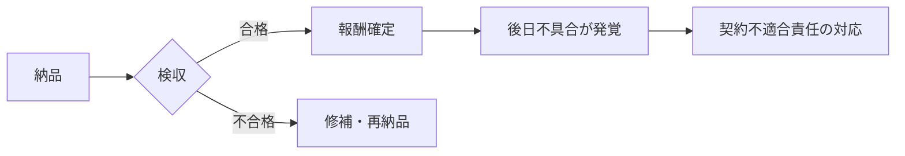

## このセクションで学ぶこと

- 請負における成果物責任(完成義務)が何を意味するかを理解する
- 検収が「合格・不合格の判断」と「責任の節目」の両方であることを把握する
- 契約不適合責任(納品物に欠陥があったときの責任)の基本的な考え方を知る

## 成果物責任 — 完成させて初めて義務を果たす

受託開発(請負)で受託側が負う中心的な義務が**成果物責任**、いわゆる完成義務です。これは「合意した仕様どおりのものを完成させて引き渡す」という約束で、作業に費やした時間や努力ではなく、できあがった成果物そのもので義務の達成が判断されます。

ここが準委任との大きな違いです。準委任は「業務を適切に遂行すること(善良な管理者としての注意義務)」が中心で、必ずしも特定の成果物の完成までは求められません。一方、請負ベースの受託開発では、完成して引き渡すまでが仕事の範囲だという前提に立ちます。そのため、完成の物差しとなる仕様の明確さが品質と責任の両面で効いてきます。

具体的に考えてみましょう。たとえば「予約管理画面を作る」という案件で、画面は動くものの一部の入力チェックが仕様どおりに動かないとします。準委任的な発想なら「依頼された作業はこなした」と言えそうですが、請負ベースの受託開発では「合意した仕様を満たす成果物が完成していない」と評価され得ます。完成義務を負うとは、こうした「あと一歩足りない」状態でも義務を果たしたことにはならない、という重さを引き受けることなのです。だからこそ、何ができていれば完成なのかをあらかじめ言語化しておくことが、受託側の自衛にもつながります。

## 検収 — 合格判定と責任の節目

納品された成果物が契約で定めた要件を満たしているかを発注者が確認し、合格と認める手続きが**検収**です。検収は二つの意味で重要な節目になります。

第一に、**報酬確定の節目**です。前のセクションで触れたとおり、請負では検収合格をもって報酬が確定する契約が多く見られます。第二に、**責任が移っていく節目**でもあります。検収を通ることで「いったん要件を満たしたものとして受け入れた」という整理になり、その後に見つかった不具合の扱いは契約不適合責任の問題へと移っていきます。

検収の基準があいまいだと「合格か不合格か」で揉めやすいため、何をもって合格とするかを契約や仕様で具体化しておくことが望ましいとされています。

## 契約不適合責任 — 納品後に欠陥が見つかったら

検収後であっても、成果物が契約で定めた品質や内容に適合していなかった場合、受託側が**契約不適合責任**を問われることがあります。これは納品物に欠陥(契約との食い違い)があったときの責任で、状況に応じて**修補**(手直し)や代替物の提供、報酬の減額、損害賠償といった対応が問題になり得ます。

ただし、責任を追及できる期間や具体的な対応の内容は契約書の定めや個別の事情によって変わります。期間を限定する取り決めが置かれることも多いため、実務では契約書の該当条項を確認することが大切です。本書では一般的な枠組みの紹介にとどめ、個別の判断は専門家や契約内容に委ねてください。

## まとめ

- 請負の成果物責任(完成義務)は、時間ではなく完成した成果物で達成が判断される。
- 検収は報酬確定と責任移転の両面で重要な節目になる。
- 検収後の欠陥は契約不適合責任の問題となり、対応や期間は契約の定めによる。
