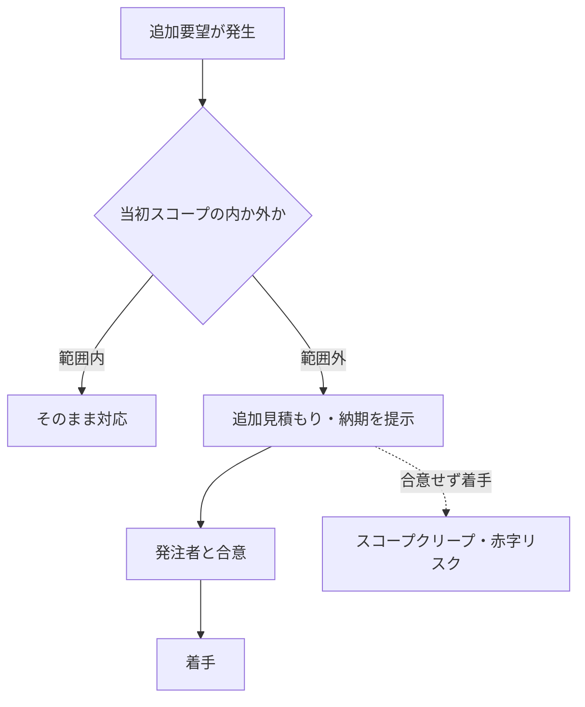

## このセクションで学ぶこと

- 仕様変更がなぜトラブルになりやすいかと、その備えの観点を理解する
- 見積もりの前提とずれが起きる仕組みを把握する
- 遅延リスクの典型と、契約・進め方で備える考え方を持てる

## 仕様変更 — 「完成」の物差しが動くと揉める

受託開発(請負)では、合意した仕様こそが「完成」の物差しです。ところが開発が進むと、発注者から「ここも直したい」「この機能も足したい」という要望が出てくるのはよくあることです。問題は、こうした変更が**当初のスコープ(作る範囲)を広げる**にもかかわらず、報酬や納期は当初のままだという認識のズレが生じやすい点にあります。

小さな追加要望が積み重なって作業量がじわじわ膨らむ現象を**スコープクリープ**と呼びます。一つひとつは小さく見えても、合算すると当初見積もりを大きく超えることがあります。備えの観点としては、変更が出たときに「それは当初スコープの内か外か」をその都度確認し、範囲外なら見積もり・納期の見直しを発注者と合意してから着手する、という進め方が一般的に推奨されます。

## 見積もりの前提がずれる

見積もりは、必ず何らかの**前提**の上に成り立っています。たとえば「要件はこの範囲で確定している」「このデータは発注者から提供される」「既存システムはこの仕様で動いている」といった条件です。これらの前提が実際と違っていると、想定外の作業が発生し、工数が膨らみます。

トラブルを避けるには、見積もりに前提条件を明記しておくことが有効とされます。前提を書いておけば、前提が崩れた場合に「ここは見積もりの範囲外でした」と説明する根拠になり、追加交渉の出発点にできます。逆に前提を曖昧にしたまま金額だけを提示すると、後から「その作業も含まれているはず」という認識の食い違いが起きやすくなります。

## 遅延 — 完成が前提だからこそ重い

請負では完成して納めることが義務の中心なので、納期の遅延は重いリスクになります。遅延の典型的な原因は、仕様の固まりが遅い、想定外の技術的困難、外部要因(発注者側の確認待ちや第三者の都合)などです。

備えとしては、進捗を定期的に共有して問題を早めに表面化させること、発注者側の作業(確認・データ提供など)の遅れが全体に影響することをあらかじめ合意しておくことが挙げられます。納期や遅延時の取り扱いは契約書で定められることが多く、具体的な責任の内容は契約の定めや個別事情によって変わります。本セクションは典型例と備えの観点の紹介にとどめ、個別の判断は契約内容や専門家に委ねてください。

## まとめ

- 仕様変更はスコープが広がるのに条件が据え置かれる認識ズレが原因。範囲の内外を都度確認する。
- 見積もりは前提の上に成り立つ。前提を明記しておくと崩れたときの交渉の根拠になる。
- 請負は完成が前提のため遅延は重い。進捗共有と発注者側作業の影響の合意で備える。
