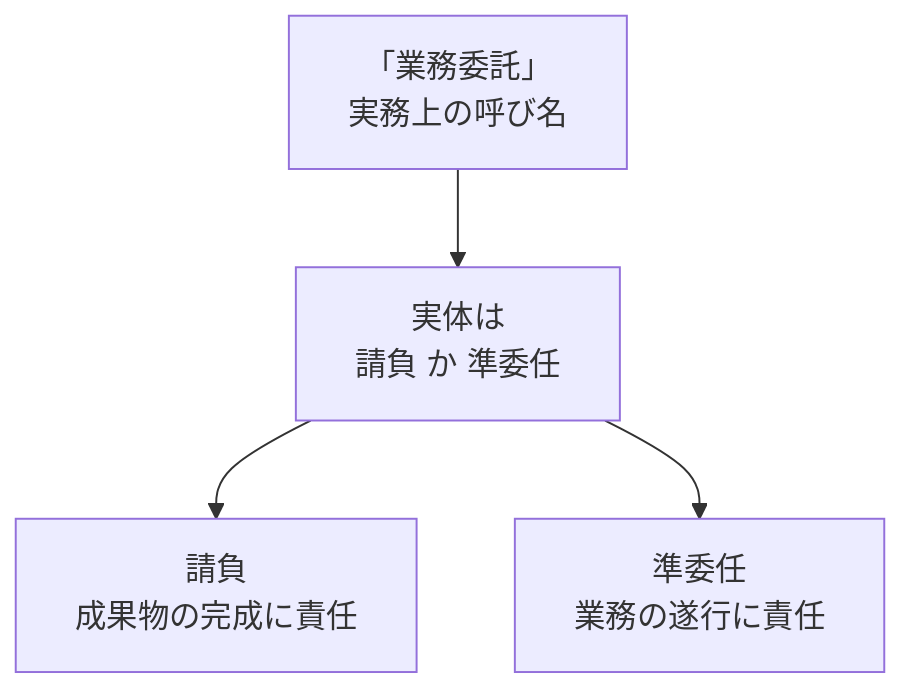

## このセクションで学ぶこと

- 「業務委託」が法律で定義された契約類型ではなく、実務上の呼び名(俗称)であること
- 民法が定める契約の型は請負・委任(準委任)などであり、「業務委託契約」という名前はそのどれかの中身を指していること
- 名前だけでは条件が決まらないため、実体を確認する姿勢が必要なこと

## 「業務委託」という言葉はどこから来たのか

エンジニアの求人や案件説明で「業務委託」という言葉を見かけることはとても多いものです。「正社員ではなく業務委託で」「業務委託契約を結びましょう」といった使われ方をします。一方で、第 1 章で扱った「請負」「準委任」と並べてみると、「業務委託」だけ少し性質が違うことに気づくかもしれません。

実は「業務委託」は、民法などの法律に独立した契約類型として定義された言葉ではありません。一般に、民法には契約の代表的な型(典型契約)として、売買・賃貸借・請負・委任などが挙げられています。「業務委託」はこの一覧には登場せず、あくまで「自社の業務の一部を外部に任せる」ことを広く指す実務上の呼び名(俗称)として使われていると理解しておくのが安全です。

つまり「業務委託」は、特定の条件をひとまとめにした決まった型ではなく、外部に仕事を任せる関係をざっくり言い表すための包括的な言い方だ、ということになります。求人広告や案件紹介の場面では、雇用(正社員・アルバイト)と区別して「会社に雇われるのではなく、独立した立場で仕事を請ける」というニュアンスを伝えるために使われることも多いものです。便利な言葉である一方、具体的な条件まではこの言葉だけからは読み取れない、という点を押さえておきましょう。

## 名前と中身がずれることがある

ここで大切なのは、「業務委託契約書」という表題が付いていても、その契約の中身(法的な性質)は請負か準委任(委任)のいずれかであることが多い、という点です。表題はあくまでラベルであり、条件を決めるのは中身に書かれた内容です。

たとえば同じ「業務委託契約」でも、「Web サイトを完成させて納品する」内容なら請負に近く、「月に何時間か開発を支援する」内容なら準委任に近い、というように、実体はかなり異なります。請負と準委任では責任の負い方や報酬の発生条件が変わってくるため(第 1 章で扱った観点)、名前が同じだからといって条件まで同じとは限らないのです。

## 「名前で判断しない」という入口の姿勢

ここで断定的な法的結論を急ぐ必要はありません。覚えておきたいのは、「業務委託だから安心」「業務委託だから不利」といった、名前だけを手がかりにした思い込みは避けたほうがよい、という入口の姿勢です。次のセクションでは、その実体が請負なのか準委任なのかをどう見極めるかを整理していきます。

## まとめ

- 「業務委託」は法律上の独立した契約類型ではなく、実務上の呼び名(俗称)です。
- その実体は請負か準委任(委任)であることが多く、どちらかで条件が変わります。
- 名前だけで判断せず、中身を確認する姿勢を入口として持っておきましょう。
