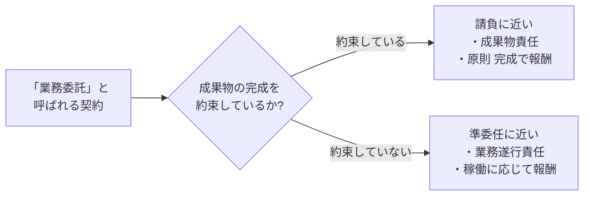

## このセクションで学ぶこと

- 同じ「業務委託」でも、実体が請負か準委任かで責任・報酬の考え方が変わること
- 「成果物の完成」を約束しているかどうかが見極めの大きな手がかりになること
- 報酬が「成果物に対して」発生するのか「業務の遂行(稼働)に対して」発生するのかで判断すること

## 「業務委託」の実体を二つに分けて考える

前のセクションで見たとおり、「業務委託」という呼び名の実体は、多くの場合、請負か準委任(委任)のどちらかに整理できます。そこでまず、自分が結ぼうとしている(あるいはすでに結んでいる)契約が、このどちらに近いのかを意識することが見極めの出発点になります。

下の図は、第 1 章で学んだ請負・準委任の特徴を「業務委託」という入口から振り分けたものです。

ここで一般的な傾向として言えるのは、請負に近い形では「成果物を完成させて引き渡す」という **成果物責任** が軸になり、準委任に近い形では、完成までは約束せず注意をもって「一定の業務を遂行する」という **業務遂行責任** が軸になる、という違いです。なお実際の契約には両方の要素が混ざることもあるため、断定は避け、あくまで見極めの手がかりとして使ってください。

## 見極めの二つの手がかり

実体を見分けるとき、特に手がかりになりやすいのが次の二つの観点です。

一つ目は「成果物の完成を約束しているか」です。「○○を完成させて納品する」「検収を経て完了とする」といった表現が中心なら、請負の性質が強いと考えられます。逆に「開発業務を支援する」「○○の作業を行う」といった、行為そのものを指す表現が中心なら、準委任の性質が強いと考えられます。

二つ目は「報酬がどう発生するか」です。成果物に対して一式いくら、という決め方は請負に近く、稼働した時間や月単位の稼働(たとえば月◯時間)に対して支払われる決め方は準委任に近い、と整理できます。

## 具体例で考える

たとえば「コーポレートサイトを制作し、検収後に一括で支払う」という案件は、成果物の完成と検収が軸なので請負に近いといえます。完成して引き渡すまで報酬が確定しにくい一方、一度引き渡せばその案件は完了し、納品物の質に責任を負うことになります。

一方、「既存サービスの開発チームに参加し、月の稼働に応じて報酬を受け取る」という案件は、完成ではなく業務の遂行が軸なので準委任に近いといえます。この場合は特定の成果物を完成させること自体を約束しているわけではなく、約束した時間や役割のなかで誠実に業務を進めることが中心になります。働いた分の報酬が積み上がっていくイメージです。

どちらも「業務委託」と呼ばれることがありますが、責任の重さも報酬の出方も異なる点に注意が必要です。同じ言葉で語られているからといって、前の案件と同じ条件だと思い込まないようにしましょう。とくに「完成しなければ報酬が出ないのか」「稼働した分は確実に支払われるのか」といった報酬条件は、生活にも直結するため早い段階で確認しておきたいところです。

## 注意点

これらはあくまで一般的な見極めの目安です。契約の性質は表題や一つの表現だけで決まるものではなく、契約全体や実際の働き方を踏まえて総合的に判断されます。迷う場合や条件が大きい場合は、思い込みで進めず、契約相手や必要に応じて専門家に確認することをおすすめします。

## まとめ

- 「業務委託」は実体として請負か準委任のどちらに近いかを意識して見極めます。
- 「成果物の完成を約束しているか」が大きな手がかりになります。
- 報酬が成果物に対してか、稼働に対してかでも性質を判断できます。
