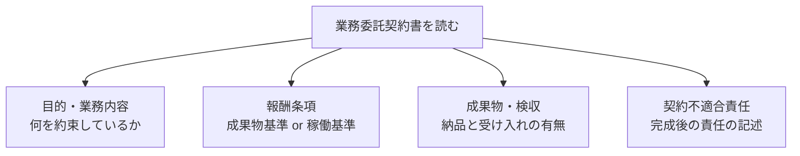

## このセクションで学ぶこと

- 表題ではなく、契約書の「目的・業務内容」「報酬条件」「成果物・検収」などの条項で実体を確認すること
- 完成義務・検収・契約不適合責任に関する記述が請負寄りか準委任寄りかのヒントになること
- 不明点は署名前に質問し、合意内容を書面で残す姿勢が大切なこと

## 表題ではなく条項を読む

ここまで見てきたように、「業務委託契約書」という表題からは実体が請負か準委任かまでは分かりません。そこで実際に確認すべきは、契約書の中の各条項です。とくに次のような項目に注目すると、実体をつかみやすくなります。

## それぞれの条項から読み取れること

「目的・業務内容」の条項では、「○○を完成させ納品する」のように完成を約束しているのか、「○○の業務を行う・支援する」のように行為を約束しているのかを確認します。前者は請負寄り、後者は準委任寄りの手がかりになります。

「報酬条項」では、成果物に対して一式で支払うのか、稼働時間や月単位の稼働に応じて支払うのかを見ます。前のセクションで触れたとおり、成果物基準なら請負寄り、稼働基準なら準委任寄りと整理できます。

「成果物・検収」や「契約不適合責任」に関する条項が手厚く書かれている場合は、完成と引き渡しを前提とした請負寄りの契約である可能性が高いといえます。逆に、これらの記述がほとんどなく、業務の遂行を中心に書かれている場合は準委任寄りと考えられます。

## 具体例と確認の進め方

たとえば「報酬は月◯時間の稼働に対して月額で支払う」と書かれていれば稼働基準で準委任寄り、「成果物の検収完了後に一括で支払う」と書かれていれば成果物基準で請負寄り、と読み取れます。両方の記述が混在している場合は、どちらの要素が中心なのかを意識し、不明な点は契約相手に質問して確認しましょう。

実務では、まず「目的・業務内容」を読んで自分が何を約束するのかをつかみ、次に「報酬条項」でお金がどう発生するのかを確かめ、最後に「成果物・検収」「契約不適合責任」の記述の有無で全体像を裏付ける、という順番で読むと整理しやすくなります。これらの条項どうしが矛盾していないか(たとえば「完成して納品する」と書きながら報酬は時間単位、といったちぐはぐさがないか)も、あわせて見ておくと安心です。

また、稼働基準であれば想定している時間の範囲や超過分の扱い、成果物基準であれば検収の基準や修正対応の範囲など、報酬条件に付随する細かな取り決めも、後のトラブルを避けるうえで確認しておきたいポイントです。気になる箇所には印を付けておき、まとめて質問するとやり取りがスムーズです。

## 注意点

条項の読み取りはあくまで実体を把握するための手がかりであり、最終的な契約の性質は契約全体や実際の運用を踏まえて判断されます。口頭で「だいたいこんな感じ」と聞いた内容は、後で食い違いの原因になりがちです。重要な条件は書面で確認し、迷う点があれば署名前に質問する、判断に不安が大きい場合は専門家に相談する、という姿勢を持っておくと安心です。

## まとめ

- 表題ではなく、目的・業務内容、報酬、成果物・検収などの条項で実体を確認します。
- 検収や契約不適合責任の記述の厚さは、請負寄りか準委任寄りかのヒントになります。
- 不明点は署名前に質問し、合意内容を書面で残す姿勢を持ちましょう。
