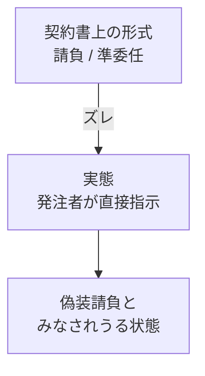

## このセクションで学ぶこと

- 偽装請負が「契約の形式」と「実際の働き方」がズレた状態を指すことを理解する
- 請負・準委任の建前なのに発注者が直接指示を出す構図が典型例であることを知る
- 偽装請負が労働者派遣の規律を回避する形になりやすい点を把握する

## 形式と実態がズレた状態

これまでの章で、請負や準委任では「指揮命令は受注側にある」のが原則だと見てきました。発注者は完成した成果物や遂行された業務を受け取る立場であって、エンジニア個人に対して日々の作業を細かく指示する立場ではない、というのが建前です。

**偽装請負**とは、契約書の上では請負や準委任(いわゆる業務委託)の形をとっているのに、実態としては発注者がエンジニアに直接、業務の進め方や勤務時間を指示している状態を指す俗称です。「請負を装っている(偽装している)」ことからこのように呼ばれます。ポイントは、契約の名前ではなく**実際にどう働いているか**で判断されるという点です。

労働者派遣であれば、派遣先がエンジニアに指示を出すこと自体は問題ありません。むしろそれが派遣の仕組みです。一方で派遣には、派遣元が許可を得ていることや、派遣できる期間の制限、派遣される人を守るための取り決めなど、働く人を守るためのルールが整えられています。偽装請負は、こうした派遣のルールを通さないまま、実質的に派遣と同じ「指示して働かせる」状態を作ってしまっている、という構図になりがちです。形式上は請負・準委任なので派遣のルールが適用されず、結果として働く人が本来受けられるはずの保護から外れてしまう、という点が問題の入り口になります。

ここで大切なのは、「偽装請負」という言葉が、誰かが意図的にズルをしている場合だけを指すわけではないということです。発注者・受注者のどちらにも悪気がなく、現場のやりとりを効率化するうちに、いつのまにか実態が派遣に近づいてしまう、というケースも少なくありません。だからこそ、契約形態を学んでおき、自分が今どういう状態で働いているのかを意識できることが大切になります。

## 典型的な構図

たとえば、ある会社(A社)がエンジニアを抱え、別の会社(B社)と「準委任契約」を結んだとします。契約上はA社がB社の業務を請け負う形ですが、実際にはB社の社員がそのエンジニアに対して「今日はこの機能を直して」「会議に出て」と日々細かく指示している――こうした状態が典型的な偽装請負のイメージです。

形式と実態のどちらが優先されるかというと、**実態**です。「契約書に準委任と書いてあるから大丈夫」とは言い切れず、現場で誰が指示を出しているかが見られる、と理解しておきましょう。逆に言えば、契約書の表題が「請負」や「業務委託」であっても、それだけで偽装請負を否定できるわけではない、ということでもあります。

もう一つの典型は、発注者の社員とエンジニアが入り混じって一つのチームを組み、発注者の管理者が全員に同じように指示を出している、という形です。チームとして働くこと自体に問題があるわけではありませんが、エンジニアへの日々の指示が誰から出ているのかが曖昧になり、実態として発注者の指揮下に入ってしまうことがあります。第4章で見た「業務委託」という呼び名は、こうした実態のズレを覆い隠してしまいやすい点にも注意が必要です。

## 注意したい点

偽装請負かどうかは、現場のひとつの指示だけで機械的に決まるものではなく、指示の内容・頻度・働き方全体を総合的に見て判断されるとされています。ここでは「契約名と実態がズレると問題になりうる」という大枠をつかんでおけば十分です。具体的な線引きは個別の事情によるため、気になる場合は会社の窓口や専門家に確認するのが安全です。

## まとめ

- 偽装請負とは、契約形式は請負・準委任なのに発注者が直接指揮命令している実態を指す俗称です。
- 判断は契約の名前ではなく、実際にどう働いているかという実態でなされます。
- 派遣のルールを通さず実質的に派遣と同じ状態になりやすい点が問題の核心です。
