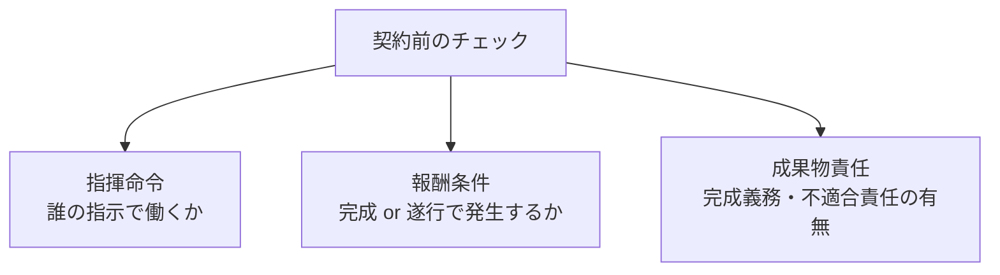

## このセクションで学ぶこと

- 自分の目的(安定・裁量・成果報酬など)に応じた契約形態の見方を持てる
- 契約前に指揮命令・報酬条件・成果物責任を確認する観点を整理できる
- 形式と実態がズレていないかを自分でチェックする視点を持てる

## 「正解の契約」より「目的に合う契約」

ここまでで、請負・準委任・SES・受託・業務委託、そして偽装請負まで見てきました。最後に、これらをどう選ぶかという視点を整理します。大前提として、どれかが絶対的に優れているわけではありません。大切なのは、**自分が何を重視するか**と契約の特徴を照らし合わせることです。

たとえば、安定して継続的に働きたいなら指揮命令や勤怠管理がはっきりした雇用や派遣が向きます。自分の裁量で進めたい・成果で評価されたいなら、請負や準委任の業務委託が候補になります。逆に、業務委託なのに細かく管理されることを望むのであれば、その期待は契約形態と噛み合っていないかもしれません。目的と形態のミスマッチが、後のトラブルや偽装請負状態の温床になります。

言い換えると、契約形態は「働き方のルールの束」をまとめて選んでいるようなものです。誰の指示で動くのか、報酬は何に対して支払われるのか、成果物の完成まで責任を負うのか――こうした条件は契約形態ごとにおおよその傾向が決まっています。だからこそ、まず自分が何を優先したいのかを言葉にしてから、その優先順位に近い形態を選ぶ、という順番が現実的です。

## 契約前に見る三つの観点

契約を結ぶ前に確認したい観点は、これまで学んだ要素に集約できます。

第一に**指揮命令**です。日々の指示を誰から受けるのかを、契約名だけでなく実際の働き方の説明から確認します。面談や打ち合わせの段階で「現場では誰の指示で動くことになりますか」と聞いてみると、実態が見えやすくなります。第二に**報酬条件**で、成果物の完成で支払われるのか(請負寄り)、業務の遂行で支払われるのか(準委任寄り)を見ます。月の稼働時間に上限・下限があるか、超過したときの扱いはどうかも合わせて確認しておくと安心です。第三に**成果物責任**で、完成義務や契約不適合責任を自分が負うのかを把握します。これらは第1章で見た区別がそのまま判断材料になります。

## 形式と実態のズレを自分で点検する

選んだ契約が実態と合っているかは、働き始めた後も意識する価値があります。「業務委託のはずなのに、毎朝の朝会で個別に作業指示を受けている」「準委任なのに成果物の完成を強く求められる」といった感覚があれば、形式と実態がズレている兆候かもしれません。

そうしたときは、自分一人で抱え込まず、所属会社の担当者に状況を伝えて確認するのが現実的です。契約形態の知識は、こうした違和感を「なんとなく嫌だ」で終わらせず、**どこがどうズレているのか**を言葉にするための道具になります。なお、個別の状況が問題に当たるかどうかの判断は専門家の領域ですので、迷う場合は社内の窓口や専門の相談先に確認しましょう。

## まとめ

- 契約形態に絶対の正解はなく、自分が重視すること(安定・裁量・成果)と特徴を照らすのが基本です。
- 契約前は指揮命令・報酬条件・成果物責任の三つを、契約名でなく実態として確認します。
- 働き始めた後も形式と実態のズレに気づけるよう、違和感は言葉にして担当者に相談しましょう。
