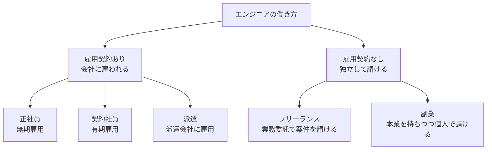

## このセクションで学ぶこと

- 雇用関係の有無を軸に、エンジニアの主な働き方を分類して俯瞰できる
- 契約社員・派遣・副業など、正社員とフリーランスの「あいだ」の選択肢を知る
- それぞれの働き方が自由度と安定性のどのあたりに位置するかをイメージできる

## 働き方は「白か黒か」ではない

前のセクションで、正社員とフリーランスを分けるのは雇用契約の有無だと学びました。ただ実際のエンジニアの働き方は、この二択だけではありません。雇われ方の強さには段階があり、その「あいだ」にもいくつかの選択肢があります。まずは雇用関係の有無を軸に、全体像を一枚の地図として眺めてみましょう。

左側(雇用契約あり)は会社に雇われて給与をもらう働き方、右側(雇用契約なし)は独立して報酬を得る働き方です。副業は、本業で雇われながら個人でも仕事を請けるため、両方にまたがる位置にあります。

## 主な働き方の特徴

地図に出てきた働き方を一つずつ見ていきます。

- **正社員**:期間の定めなく(無期雇用)会社に所属します。最も安定性が高い一方、勤務時間や業務内容は会社のルールに従います。
- **契約社員**:雇用契約を結ぶ点は正社員と同じですが、「1 年契約」のように **契約期間に定めがある**(有期雇用)のが特徴です。プロジェクト単位で採用されることもあります。
- **派遣**:**派遣会社に雇用** され、給与は派遣会社から受け取りつつ、実際の業務は派遣先の会社で行います。「雇う会社」と「働く現場」が分かれるのが特徴です。
- **フリーランス**:どの会社にも雇われず、業務委託契約で案件ごとに仕事を請けます。自由度が高い反面、仕事を自分で確保する必要があります。
- **副業**:正社員などの本業を持ちながら、空き時間に個人で案件を請ける形です。本業の安定を保ったままフリーランス的な働き方を試せます。

## 自由度と安定性はトレードオフになりやすい

これらの働き方は、おおまかに言えば **自由度が高いほど安定性は下がり、安定性が高いほど自由度は下がる** という関係にあります。正社員は安定しているが自由度は限られ、フリーランスは自由だが収入は不安定になりがちです。契約社員・派遣・副業は、その中間や組み合わせとして位置づけられます。

注意したいのは、「どれが優れているか」ではなく「自分の状況にどれが合うか」という視点です。同じ人でもライフステージによって最適な働き方は変わります。たとえば若いうちは副業で試し、家庭ができたら安定を重視して正社員に戻る、といった移り変わりも自然なことです。具体的な比較は次のセクション以降で、共通のものさしを使って見ていきます。

## まとめ

- 働き方は正社員とフリーランスの二択ではなく、契約社員・派遣・副業などの選択肢がある。
- 雇用契約の有無を軸にすると、全体を一枚の地図として整理できる。
- おおむね自由度と安定性はトレードオフ。優劣ではなく自分に合うかで考える。
