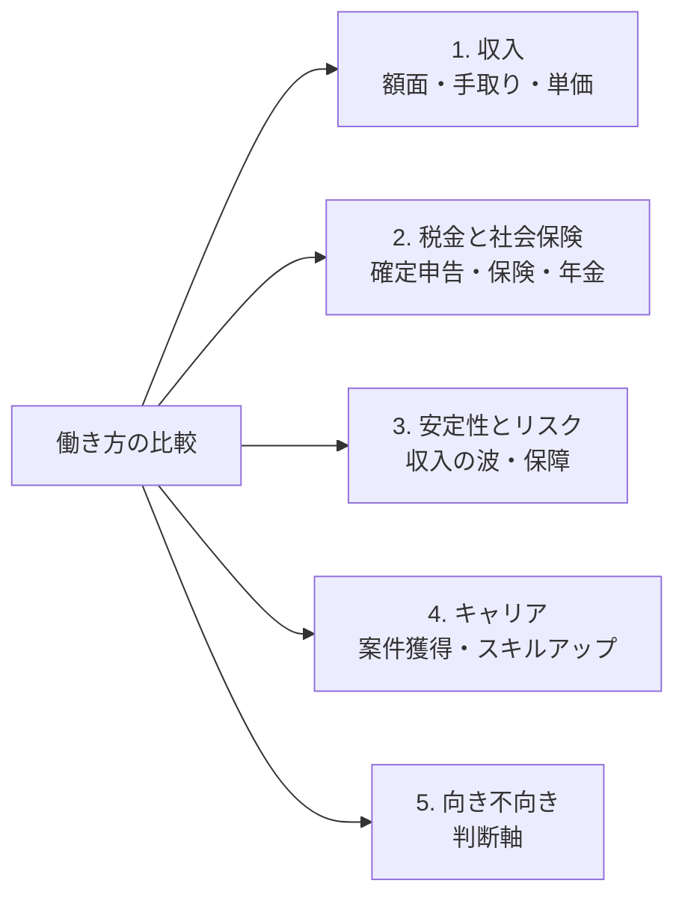

## このセクションで学ぶこと

- 働き方を比較するための5つの軸(収入・税金と社会保険・安定性・キャリア・向き不向き)を理解する
- 各軸がこの教材のどの章に対応するかを把握し、学習の見通しを持つ
- 一つの軸だけで優劣を決めず、複数の軸を組み合わせて考える姿勢を持つ

## なぜ「軸」を決めるのか

働き方を比べるとき、「フリーランスは稼げる」「正社員は安定している」といった断片的な印象だけで判断すると、後で「思っていたのと違った」となりがちです。たとえば報酬の金額だけを見て独立したものの、税金や保険の負担を計算に入れていなかった、というのはよくある話です。

そこで本教材では、働き方を **同じものさし=比較軸** で見ていきます。軸をそろえることで、感覚ではなく根拠をもって自分に合う働き方を考えられるようになります。ここでは、これから章を追って扱う5つの軸を先に俯瞰しておきましょう。

## 5つの比較軸

1. **収入** — 額面の金額だけでなく、実際に手元に残る **手取り** や、フリーランス特有の「単価」の考え方を比べます(第2章)。
2. **税金と社会保険** — 年末調整と確定申告の違い、健康保険・年金・雇用保険の扱いがどう変わるかを見ます(第2章)。
3. **安定性とリスク** — 収入の波、案件が途切れるリスク、病気や休業時の保障の違いを扱います(第3章)。
4. **キャリア** — 案件の獲得方法、スキルアップや評価のされ方、長期的なキャリアの描き方を比べます(第4章)。
5. **向き不向き** — これまでの軸を踏まえ、どんな人にどの働き方が合うか、自分で選ぶための判断軸を整理します(第5章)。

## 軸ごとに見える景色が変わる

5つの軸を使うと、同じ働き方でも軸を変えるたびに評価が変わることが見えてきます。たとえばフリーランスは、収入の軸では「単価次第で正社員より多く稼げる」と魅力的に映ります。しかし税金と社会保険の軸に持ち替えると、確定申告の手間や、会社が半分負担してくれていた社会保険料を全額自分で払う負担が見えてきます。さらに安定性の軸では、案件が途切れたときに収入がゼロになりうるという不安が浮かび上がります。

逆に正社員は、安定性の軸では強いものの、収入の軸では上限が見えやすく、キャリアの軸では「会社が用意した役割の範囲」に伸びしろが縛られることもあります。このように、軸を一つずつ当てていくと、印象だけでは気づけなかった長所と短所が立体的に見えてきます。これがものさしをそろえて比べることの最大の利点です。

## 一つの軸だけで決めない

ここで大事なのは、**どれか一つの軸だけで結論を出さない** ことです。たとえば収入の軸では魅力的に見えても、安定性の軸では不安が大きい、という働き方はよくあります。逆に、安定を重視するあまりキャリアの伸びしろを犠牲にしているかもしれません。

実際の判断では、複数の軸での評価を並べたうえで、いまの自分が何を優先したいか(お金か、自由か、安心か、成長か)と照らし合わせます。優先順位は人それぞれで、唯一の正解はありません。たとえば貯蓄に余裕がなく当面の安心を最優先したい時期なら安定性の軸を重く、スキルを一気に伸ばして単価を上げたい時期なら収入とキャリアの軸を重く、というように同じ人でも時期によって重み付けは変わります。この教材を読み終えるころには、5つの軸で自分なりに整理し、納得して選べる状態を目指します。

## まとめ

- 本教材は収入・税金と社会保険・安定性・キャリア・向き不向きの5軸で働き方を比べる。
- 各軸はこのあとの第2章から第5章で順に詳しく扱う。
- 一つの軸だけで決めず、複数の軸と自分の優先順位を照らし合わせて判断する。
