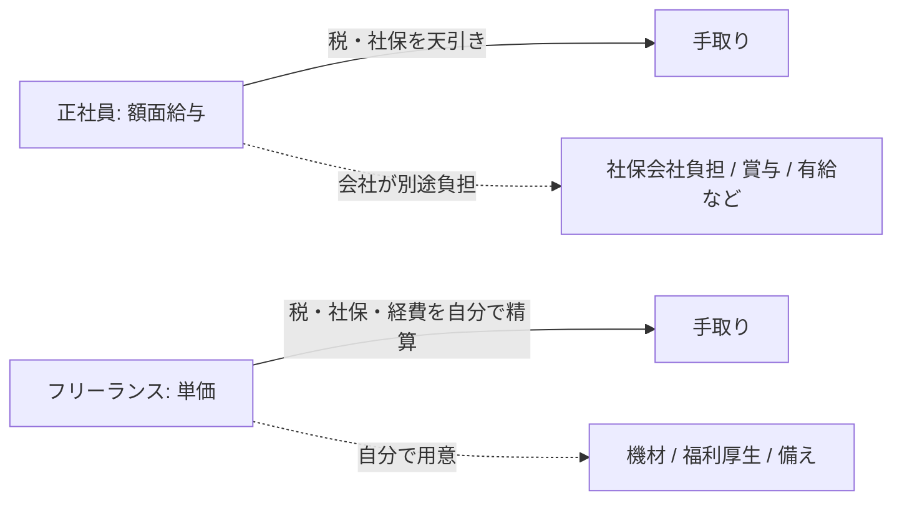

## このセクションで学ぶこと

- 額面と手取りの違い、給与から何が差し引かれるのかを理解する
- フリーランスの「単価」が給与とは別物であることを押さえる
- 同じ金額でも正社員の給与とフリーランスの報酬では意味が異なる理由を知る

## 額面と手取りは別物

求人票や内定通知に書かれている「年収 600 万円」のような金額は、ほとんどの場合 **額面** です。額面とは、税金や社会保険料が差し引かれる前の支払い総額のことです。しかし、実際にあなたの銀行口座へ振り込まれるのはその金額ではありません。ここから所得税・住民税・社会保険料などが天引きされ、残った分が **手取り** になります。

正社員の場合、給与から差し引かれる主なものは次のとおりです。所得税、住民税、健康保険料、厚生年金保険料、雇用保険料です。これらは会社が給与計算の段階で自動的に天引きし、本人に代わって納めてくれます。差し引かれる割合は収入や扶養家族の有無で変わりますが、おおむね額面の 2 割前後が引かれ、手取りは額面の 8 割程度になる、というのが大まかな感覚です。

つまり「年収 600 万円」と聞いても、自由に使えるお金が 600 万円あるわけではありません。働き方を比べるときは、額面の数字だけでなく「最終的に手元にいくら残るか」を意識することが出発点になります。手取りまで踏み込んだ比較は、このあとのセクションで順を追って見ていきます。

## フリーランスの「単価」とは

一方フリーランスには「給与」という概念がありません。代わりに案件ごとの **単価** で報酬が決まります。たとえば「月額単価 70 万円の案件」「時間単価 5,000 円の業務委託」といった形です。単価は、その案件に対してクライアントが支払う報酬総額であって、正社員の給与とは性質が違います。

ここで注意したいのは、**フリーランスの単価には、正社員なら会社が負担していたものが含まれていない、あるいは自分で負担する前提になっている**点です。たとえば社会保険料の会社負担分、有給休暇、賞与、退職金、福利厚生といったものは、フリーランスの単価には織り込まれていません。さらにフリーランスは、業務に使う機材・ソフトウェア・通信費などを自分で用意するのが基本です。

そのため「月単価 70 万円」を 12 か月分そのまま足して「年収 840 万円だから正社員の年収 600 万円より得だ」と単純に比較することはできません。単価は手取りでもなければ、福利厚生込みの価値でもないからです。

## 同じ金額でも意味が違う

具体的に整理してみましょう。正社員の額面年収 600 万円には、社会保険料の会社負担分や賞与、有給などの価値が「すでに乗っている」状態です。対してフリーランスの報酬は、そうしたものをすべて自分で賄う前提の「素」の金額です。

このように、同じ「600 万円」でも前提条件がまったく異なります。働き方を比較するうえで大切なのは、額面・単価という入口の数字に惑わされず、「そこから何が引かれ、何を自分で負担するのか」をセットで考える姿勢です。次のセクションからは、引かれるものの代表である税金と社会保険を具体的に見ていきます。

## まとめ

- 額面は天引き前の総額、手取りは実際に残る金額で、両者は別物です。
- フリーランスの単価には会社負担分や福利厚生が含まれず、給与とは性質が違います。
- 同じ金額でも前提が異なるため、入口の数字だけで損得を判断できません。
