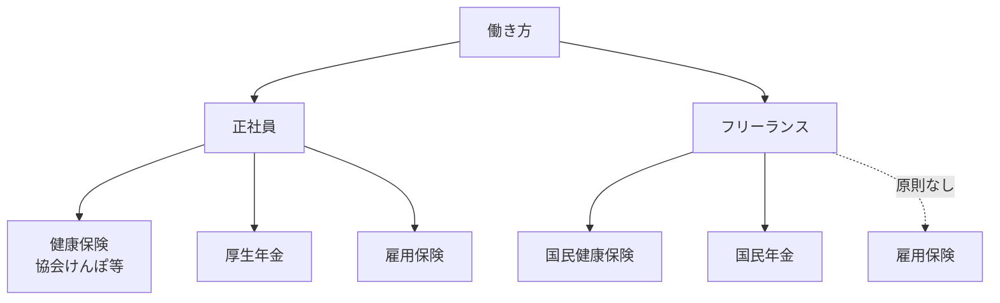

## このセクションで学ぶこと

- 健康保険・年金の加入先が働き方でどう変わるかを理解する
- 保険料の会社負担という正社員のメリットを把握する
- 雇用保険や労災が原則フリーランスにはない点と、その意味を知る

## 加入する制度が変わる

社会保険は、働き方によって「どの制度に入るか」が変わります。日本の公的な仕組みでは、おおまかに会社に雇われて働く人向けの制度と、自営業者など向けの制度に分かれています。

正社員は、会社を通じて **健康保険**(健康保険組合や協会けんぽなど)と **厚生年金** に加入するのが一般的です。これらは「被用者保険」と呼ばれ、会社が手続きや納付を担います。一方、会社に雇われていないフリーランスは、市区町村の **国民健康保険** と **国民年金** に自分で加入するのが基本的な形です。

加入先が違うと、保険料の計算方法や将来受け取れる年金額の考え方も変わってきます。たとえば厚生年金は国民年金に上乗せされる構造のため、将来の年金額は厚生年金に加入していた期間や報酬の影響を受けます。

## 保険料を誰が負担するか

正社員にとって見逃せないのが、**保険料の会社負担** です。健康保険料と厚生年金保険料は、会社と従業員が原則として折半で負担する仕組みになっています。つまり、給与明細に表示されて天引きされている保険料と同じくらいの額を、会社が別途あなたのために負担しているということです。

フリーランスにはこの会社負担がありません。国民健康保険料・国民年金保険料は全額自分で納めます。これは前のセクションで触れた「単価には会社負担分が含まれていない」という話と直結します。フリーランスの報酬が正社員の給与より高く見えても、保険料を全額自己負担する前提だと、その差は思ったほど大きくないことがあります。

## 雇用保険・労災という安全網

もう一つの大きな違いが **雇用保険** と労災保険です。雇用保険は、雇われて働く人が失業したときの給付などを受けられる仕組みで、正社員は原則として加入します。会社を辞めて次の仕事を探す間、一定の条件のもとで給付を受けられる可能性があるのは、この雇用保険があるからです。

フリーランスは雇用されているわけではないため、原則として雇用保険には加入しません。つまり、案件が終わって収入が途切れても、失業給付にあたるものは基本的にありません。仕事中のケガなどに備える労災保険についても、雇われている労働者向けの制度であり、フリーランスは原則対象外です(一部に特別加入などの例外的な仕組みがある場合もあります)。

このため、フリーランスは「収入が止まったとき」「働けなくなったとき」の備えを、貯蓄や民間の保険などで自分で用意しておく必要があります。安全網の有無は、第 3 章で扱う安定性・リスクの話にもつながる重要な観点です。なお、社会保険の制度は改正されることがあり、適用範囲も個別事情で変わるため、本セクションは一般的な概要にとどめます。

## まとめ

- 正社員は健康保険・厚生年金、フリーランスは国民健康保険・国民年金が基本です。
- 正社員は保険料を会社と折半、フリーランスは全額自己負担になります。
- 雇用保険や労災は原則フリーランスにはなく、備えを自分で用意する必要があります。
