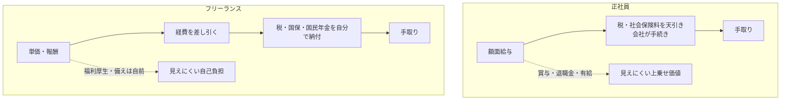

## このセクションで学ぶこと

- 額面・単価から手取りまで、何が差し引かれるのかを一気に整理する
- 同じ金額でも正社員とフリーランスで残るお金が違う理由をまとめて理解する
- 単純な数字比較ではなく「見えにくいコスト」も含めて考える視点を持つ

## ここまでの話をひとつにまとめる

このセクションは、これまで見てきた給与・報酬・税金・社会保険の話を一本につなげて整理する回です。前の三つのセクションでは、額面と手取り、給与所得と事業所得、社会保険の加入先という観点を順に見てきました。それらを「同じ金額からスタートしたら、最終的に手元にいくら残るのか」という一つの流れに並べてみます。

ポイントは、正社員もフリーランスも、入口の数字(額面・単価)からいくつかの段階を経て手取りにたどり着くという点では同じだということです。ただし、途中で差し引かれるものと、その手続きを誰がやるかが大きく違います。次の図は、その流れを並べて比べたものです。

## 同じ金額でも残るお金は違う

ここで強調したいのは、額面年収 600 万円の正社員と、年間の報酬合計が 600 万円のフリーランスを並べても、両者の「手取り」や「実質的な豊かさ」は同じにならないということです。理由は大きく二つあります。

一つ目は、差し引かれる中身の違いです。正社員は社会保険料を会社と折半しますが、フリーランスは国民健康保険料・国民年金保険料を全額自分で納めます。一方でフリーランスは経費を差し引ける余地があり、必要な支出をきちんと計上すれば課税される所得を抑えられます。差し引かれる方向と調整できる方向の両方があるため、単純にどちらが多く残るとは言い切れません。

二つ目は、給与明細には現れない **見えにくいコスト** の存在です。正社員には賞与・退職金・有給休暇・福利厚生といった、額面の数字に直接は出てこない価値が乗っています。逆にフリーランスは、収入が途切れたときの備えや機材・保険などを自分で用意する必要があり、これは見えにくい自己負担です。数字の大小だけを比べると、この部分を見落としてしまいます。

## 数字だけで判断しないために

働き方を比べるときに「単価が高いほうが得」と短絡しないことが大切です。実務では、年間を通じてどれくらい稼働できるか、経費としてどれだけ計上できるか、保障を自分でどこまで用意するか、といった条件で手取りの実感は大きく変わります。

なお、ここで示したのはあくまで考え方の整理であり、具体的な税額や保険料は収入・地域・扶養・制度改正などによって変わります。正確な金額を知りたい場合は、最新の制度や税理士などの専門家に確認してください。収入面の比較はここで一区切りとし、次の章では収入の「安定性」とリスクという別の軸を見ていきます。

## まとめ

- 入口の金額が同じでも、差し引かれる中身と手続きの担い手が違うため手取りは一致しません。
- フリーランスは社保を全額自己負担する一方、経費で調整できる余地があります。
- 賞与・退職金などの見えにくい価値と自己負担も含めて、数字だけで損得を判断しないことが大切です。
