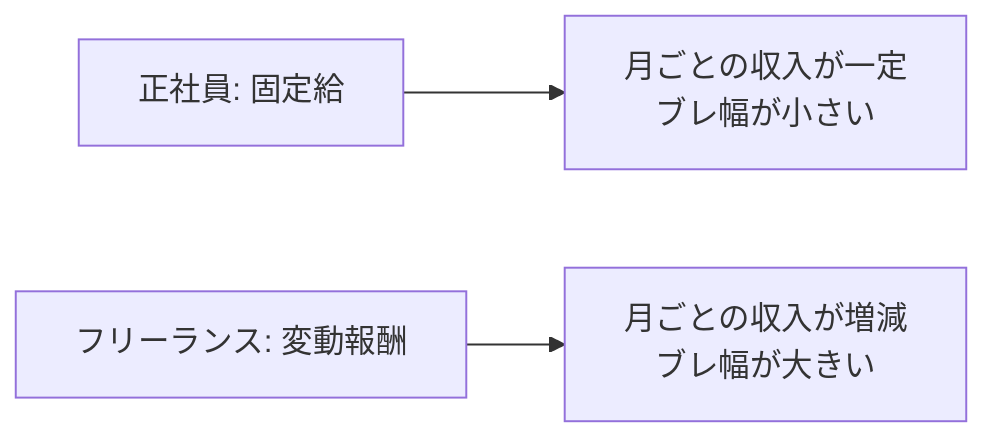

## このセクションで学ぶこと

- 固定給(正社員)と変動報酬(フリーランス)の構造的な違いを理解する
- 収入の「平均」だけでなく「ブレ幅」で安定性をとらえる視点を持つ
- 変動報酬には上振れの可能性と下振れのリスクが同居することを把握する

## 固定給と変動報酬という二つの形

収入の安定性を考えるとき、まず押さえたいのが「収入がどう決まるか」という構造です。正社員の収入は **固定給** が中心です。雇用契約にもとづいて毎月ほぼ一定の金額が支払われ、繁忙期でも閑散期でも、原則として月給は大きく変わりません。賞与や残業代で多少の上下はありますが、ベースとなる金額が約束されている点が特徴です。

一方、フリーランスの収入は **変動報酬** が中心です。報酬は受けている案件の数・単価・稼働時間によって決まるため、月ごとに金額が変わります。案件が複数重なれば収入は増えますが、案件と案件の間が空けばその月の収入は減ります。つまり「働いた分・契約した分」がそのまま収入に反映されやすいのが変動報酬です。

第 2 章で扱った「単価」の考え方は、この変動報酬の土台になります。単価が高くても稼働が少なければ月収は伸びませんし、逆に稼働を増やしすぎれば体調や品質に影響します。報酬の総額は「単価 × 稼働」で動くと理解しておくと、収入の見通しが立てやすくなります。

## 「平均」より「ブレ幅」で見る

収入の安定性は、年収の **平均** だけで測ると見誤りやすい論点です。たとえば年収が同じ 600 万円でも、毎月 50 万円ずつ入る場合と、80 万円の月もあれば 20 万円の月もある場合とでは、生活設計のしやすさがまるで違います。後者は平均こそ同じでも **収入のブレ幅** が大きく、心理的な負担や資金繰りの難しさが増します。

具体的に考えてみましょう。正社員のエンジニアは、たとえ担当プロジェクトが一時的に落ち着いても、その月の給与が半分になることはまずありません。会社が収入のブレを吸収してくれている状態です。対してフリーランスは、契約が一本終わって次が決まるまでの空白期間に、収入がゼロに近づく月が生じ得ます。同じ年収を得ていても、月単位で見れば波の大きさがまったく異なるのです。

## 上振れと下振れは同居する

変動報酬には注意点があります。それは、上振れの可能性と下振れのリスクが **同じコインの裏表** だということです。フリーランスは案件を増やしたり単価交渉に成功したりすれば、正社員時代より収入が大きく伸びることがあります。これは固定給にはない魅力です。

しかし同じ仕組みが、案件が減れば収入が大きく落ちるという形でも働きます。「稼げるときに稼げる」自由は、「稼げないときは収入が細る」不安定さと表裏一体です。どちらか一方だけを取り出して比べると判断を誤ります。安定を重視するなら固定給に価値があり、収入の伸びしろや裁量を重視するなら変動報酬に価値がある、という整理で考えるのが実務的です。

実務では、変動報酬の不安定さを和らげる工夫も知られています。たとえば長期の契約を一本確保して収入の土台を作り、その上に短期の案件を重ねるという組み合わせ方です。土台部分が固定給に近い役割を果たすため、月ごとの落ち込みを小さくできます。変動報酬だからといってすべてを成り行きに任せるのではなく、収入のうちどこを安定させ、どこで伸ばすかを意識して設計する姿勢が、安定性と収入の両立につながります。次のセクションでは、この変動の最大の要因である「契約の終了」について詳しく見ていきます。

## まとめ

- 正社員は固定給で収入が一定、フリーランスは変動報酬で月ごとに増減する
- 安定性は平均年収だけでなく「収入のブレ幅」で見ると実態に近い
- 変動報酬の上振れと下振れは表裏一体で、自由と不安定さはセットで考える
