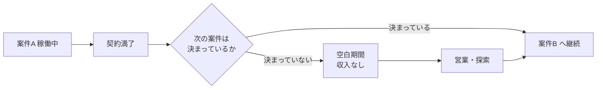

## このセクションで学ぶこと

- フリーランス特有の「契約終了」「案件途切れ」のリスクを具体的に理解する
- 業務委託契約と雇用契約で終了のしやすさ・予告のされ方が異なることを把握する
- 複数案件の分散や契約条件の確認といった備えの考え方を持つ

## 契約の終わり方が違う

フリーランスが企業と仕事をするとき、多くは **業務委託契約** を結びます。これは「この仕事を、この期間、この条件でやります」という約束で、正社員が結ぶ雇用契約とは性質が異なります。業務委託契約には **契約期間** が定められていることが多く、エンジニアの常駐・準委任の案件では 3 か月や 6 か月といった単位で区切り、更新を重ねていく形が一般的です。

ここに正社員との大きな違いがあります。正社員の雇用契約は、会社側からの一方的な終了(解雇)に法律上の強い制約があり、簡単には打ち切られません。一方、業務委託契約は期間満了をもって自然に終了するのが基本で、更新されなければそこで関係は終わります。「契約を続けるかどうか」は更新のたびに判断されるため、正社員に比べて関係の継続性は弱いと考えておくのが現実的です。

なお、法律上の取り扱いは契約内容や実態によって変わる部分があり、ここでは一般的な傾向として説明しています。実際の契約では、契約書に書かれた期間・更新・解約の条項を必ず確認することが大切です。

## 案件が「途切れる」というリスク

フリーランス最大のリスクの一つが **案件の途切れ** です。一つの契約が終わったあと、次の契約がすぐに始まるとは限りません。その空白期間は収入が発生しないため、前のセクションで見た「収入のブレ幅」が現実の困りごととして表れます。

たとえば 6 か月の常駐案件が終わり、次の案件が見つかるまでに 1 か月かかったとします。その 1 か月は売上がほぼゼロでも、生活費・社会保険料・税金の支払いは止まりません。正社員であれば、担当プロジェクトが終わっても会社が次の仕事を割り当ててくれますが、フリーランスは自分で次を見つけるまで収入の空白が続くという構造です。

## 備えの考え方

このリスクは消し去ることはできませんが、和らげる工夫はあります。一つは **案件の分散** です。一社だけに依存せず複数の取引先を持っておけば、一本が終わっても収入がゼロにはなりにくくなります。もう一つは **契約条件の確認** です。更新の有無、終了時の予告期間、途中解約の条件などを契約書で事前に把握しておけば、急な終了に慌てずに済みます。

加えて、空白期間に備えた **生活防衛資金** を持っておくことも実務上の定石です。一般に数か月分の生活費を確保しておくと、次の案件をあせって悪条件で受けずに選べるようになります。リスクをゼロにするのではなく、途切れても耐えられる状態を作っておく、という発想が大切です。

## まとめ

- 業務委託契約は期間満了で終わるのが基本で、正社員より関係の継続性が弱い
- 案件が途切れると収入の空白が生じ、支払いは止まらないため備えが要る
- 取引先の分散・契約条件の確認・生活防衛資金でリスクを和らげられる
