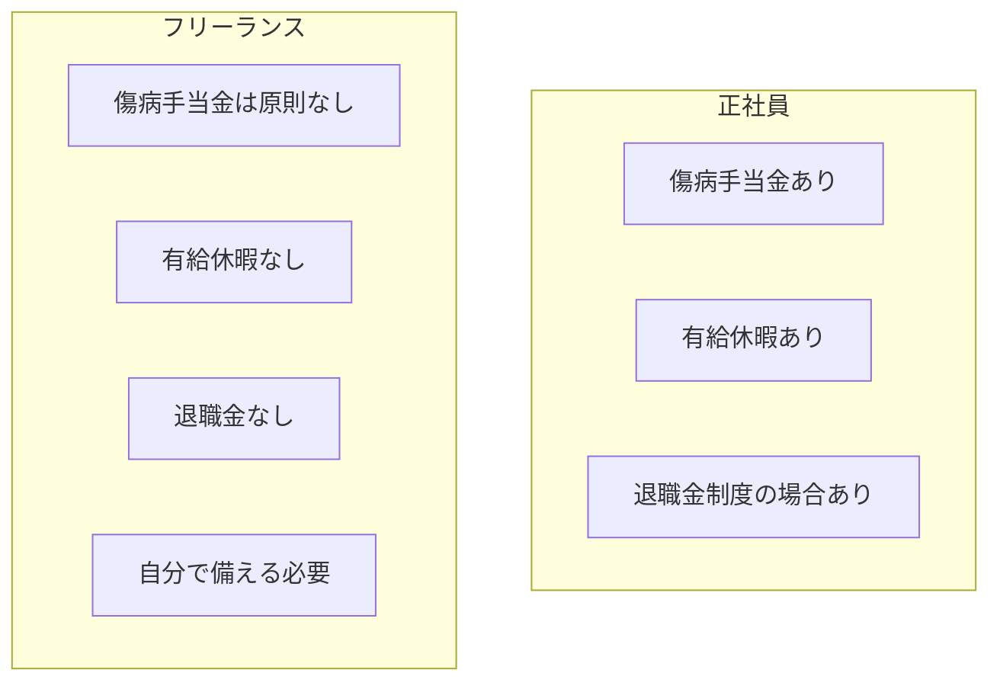

## このセクションで学ぶこと

- 病気・ケガ・休業時の保障が正社員とフリーランスでどう違うかを理解する
- 退職金・有給休暇など正社員に用意された保障の存在を把握する
- フリーランスは保障を自分で用意する必要があることと、その手段の方向性を知る

## 「働けなくなったとき」に差が出る

収入の安定性とならんで重要なのが、**働けなくなったときの保障** です。健康なうちは見えにくい論点ですが、病気・ケガ・休業のような「もしも」のときにこそ、働き方の違いが大きく表れます。

正社員には、雇用に付随する保障がいくつも用意されています。たとえば病気やケガで一定期間働けないとき、会社員向けの健康保険からは **傷病手当金** が支給される仕組みがあります。また **有給休暇** が法律で付与されるため、体調を崩しても賃金を受け取りながら休めます。会社によっては退職金制度もあり、長く勤めれば退職時にまとまった支給を受けられることがあります。これらは「働き続けられない期間」を支える安全網として機能します。

一方フリーランスは、これらの保障が原則として用意されていません。第 2 章で見たとおり、フリーランスが入る国民健康保険には傷病手当金にあたる制度が基本的になく、休めばその分の報酬は入らないのが通常です。有給休暇や退職金もありません。つまり「休んでも収入が続く」前提が成り立ちにくいのです。

## 保障の有無を対比で見る

正社員とフリーランスの保障の違いを整理すると、次のようになります。

この対比でわかるのは、正社員は **保障があらかじめ組み込まれている** のに対し、フリーランスは **保障を自分で組み立てる** 必要があるという構造の違いです。なお、制度の細かい内容や対象範囲は加入している保険や個々の状況によって変わるため、ここでは一般的な傾向として捉えてください。

## フリーランスは自分で備える

では、フリーランスはどう備えればよいのでしょうか。方向性は大きく二つあります。一つは **貯蓄による備え** です。前のセクションで触れた生活防衛資金は、案件途切れだけでなく、病気で働けない期間にも効いてきます。もう一つは **民間の保険や制度の活用** です。たとえば働けなくなったときの収入減に備える **所得補償保険** のような商品や、将来に備える各種の積立・共済の仕組みがあります。

ここで大切なのは、特定の商品を勧めることではなく、「正社員なら自動的に受けられた保障を、フリーランスは意識して自分で埋める必要がある」という視点を持つことです。具体的に何を選ぶかは収入や家族構成、リスクの感じ方によって変わるため、必要に応じて専門家に相談しながら検討するのが安全です。保障の差を知ったうえで備えるかどうかで、いざというときの安心感は大きく変わります。

## まとめ

- 正社員は傷病手当金・有給休暇・退職金など保障が雇用に組み込まれている
- フリーランスはこれらが原則なく、休めば収入が止まりやすい
- 貯蓄や民間保険などで自分で保障を組み立てる視点を持つことが備えになる
