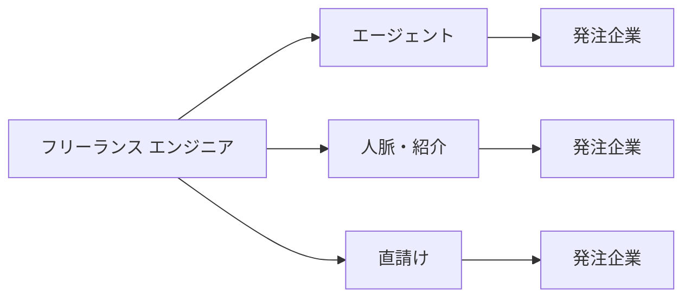

## このセクションで学ぶこと

- フリーランスの案件獲得には大きく分けて「エージェント」「人脈・紹介」「直請け」の3つの経路があることを理解する
- それぞれの経路の手間・単価・安定性のトレードオフを把握する
- 経路を組み合わせて案件が途切れにくい状態をつくる考え方を持つ

## 案件は「自分で取りに行く」もの

正社員であれば、仕事は会社が用意してくれます。一方フリーランスは、自分で仕事(案件)を見つけて契約しなければ収入が発生しません。前章で見たとおり、案件が途切れることはフリーランス特有のリスクですが、その裏返しとして「どの経路で案件を獲得するか」が働き方の土台になります。

エンジニアの案件獲得の経路は、大きく次の3つに整理できます。

## 3つの経路とトレードオフ

**エージェント経由**は、フリーランス向けの案件紹介サービスに登録し、希望条件に合う案件を紹介してもらう方法です。営業を代行してもらえるため案件を見つけやすく、契約手続きや報酬の支払いサイクルも整っていることが多いのが利点です。一方で、エージェントは仲介の対価として**マージン**を受け取るため、発注企業が支払う金額の一部が手数料として差し引かれます。手間が少ない代わりに、直接契約より手取り単価が下がりやすい傾向があります。

**人脈・紹介**は、前職の同僚や知人、勉強会やコミュニティでのつながりから仕事を得る方法です。すでに信頼関係があるぶん条件交渉がしやすく、ミスマッチも起こりにくいのが特徴です。ただし、紹介は相手任せの面があり、自分の都合に合わせて案件が湧いてくるわけではありません。日頃からの関係づくりが前提になります。

**直請け**は、企業と直接契約する方法で、仲介手数料がないぶん単価が高くなりやすいのが魅力です。その代わり、営業・見積もり・契約書の確認・請求といった事務をすべて自分で行う必要があり、トラブル時の交渉も自力です。手間とリスクを引き受けるかわりにリターンも大きい、という関係になります。

## 注意点 — 1つの経路に頼り切らない

たとえばエージェント1社だけに頼っていると、その会社の扱う案件が減ったときに収入が一気に細る恐れがあります。実務では、エージェントで安定した稼働を確保しつつ、人脈経由の案件や直請けを少しずつ増やしていく、というように**経路を複数持っておく**のが現実的です。また、契約形態(準委任・請負など)や報酬の支払い条件は経路によって異なるため、契約前に条件をよく確認することが欠かせません。法的・税務的な細かい扱いは個別の契約や状況によって変わるため、必要に応じて専門家に相談するとよいでしょう。

## まとめ

- 案件獲得の主な経路は「エージェント」「人脈・紹介」「直請け」の3つ。
- 手間が少ない順にエージェント→紹介→直請けだが、単価は逆の傾向になりやすい。
- 1つの経路に依存せず複数を組み合わせると、案件が途切れにくくなる。
