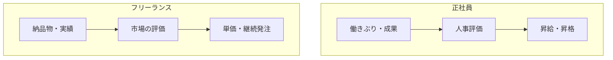

## このセクションで学ぶこと

- 正社員とフリーランスでスキルアップの機会の与えられ方がどう違うかを理解する
- 評価が「人事評価」か「成果と単価」かという軸の違いを把握する
- 自分で学びと評価のサイクルを設計する必要性に気づく

## 「育ててもらう」か「自分で育つ」か

スキルアップの観点で正社員とフリーランスを比べると、最も大きな違いは**学びの機会が誰の手で用意されるか**です。

正社員には、研修制度や**OJT**、先輩からのコードレビュー、社内勉強会といった育成の仕組みが用意されていることが多くあります。会社が長期的に人材を育てる前提に立っているため、未経験の領域に挑戦させてもらえたり、資格取得の費用を補助してもらえたりすることもあります。学びのコストの一部を会社が負担してくれる、と言い換えられます。

フリーランスは、こうした仕組みが基本的に自分の外にはありません。新しい技術を学ぶ時間も費用も自分持ちで、案件は「すでにできること」を前提に発注されるのが普通です。たとえば、新しいフレームワークを扱う案件に入りたくても、業務時間内にゼロから教わりながら覚える、という進め方は想定されにくいのが実情です。そのため、稼働の合間に意識して学習時間を確保し、自分でスキルの幅を広げていく必要があります。逆に言えば、現場で求められる技術を先回りして学んでおくことが、そのまま案件の幅と単価につながるという面もあります。

## 評価の物差しが違う

評価のされ方も対照的です。

正社員は、上司や会社の基準による**人事評価**を通じて、昇給・昇格・配置といった形で処遇が決まります。成果だけでなく、チームへの貢献やプロセスも見られることが多く、評価のサイクルは半年や1年といった単位です。

フリーランスは、納品した成果物や案件での働きが、そのまま市場での評価につながります。評価は**単価**や「次もお願いしたい」という継続発注・紹介という形で、より直接的に返ってきます。半年に一度の評価面談を待つのではなく、案件が終わるたびに結果が出る、というイメージです。良くも悪くも結果がダイレクトに跳ね返ってくるのが特徴で、期待を超えれば単価アップや次の紹介につながりやすい反面、期待に届かなければ次の依頼が来ないという形で表れます。

## 注意点 — 評価の「見えにくさ」に備える

フリーランスの評価は数字や継続依頼に表れる一方で、「どこを改善すれば単価が上がるか」を丁寧にフィードバックしてくれる人は多くありません。正社員時代のように上司が成長を後押ししてくれるとは限らないのです。だからこそ、案件の振り返りを自分で行う、信頼できる同業者に意見をもらう、得意分野を言語化して見せられるようにする、といった工夫で学びと評価のサイクルを自分で回す姿勢が役立ちます。なお、報酬や単価の水準は景気や需要にも左右されるため、ここで述べたのはあくまで一般的な傾向です。

## まとめ

- 正社員は会社が学びの機会を用意し、フリーランスは自分で学びを設計する。
- 評価は正社員が人事評価、フリーランスが単価・継続発注という形で返ってくる。
- フィードバックが乏しい分、振り返りと自己評価の仕組みを自分で持つとよい。
